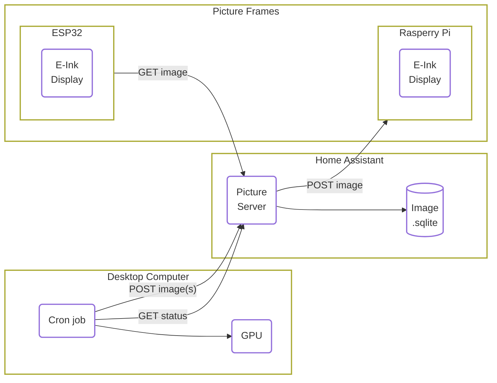

TODO: insert images of the frame, front and back, with a gif for when it changes the image to show what it can do.
TODO: explain what it is before why
TODO: performance expectations( image fresh, battery life)
TODO: cost
TODO: Hardware for the product
TODO: software for the product
TODO: tools to get it done, need to have, and nice to have category
TODO: skill required on the hardware side
TODO: skill required on the software side

I want to build a home e-ink based picture, where the content is generated by AI diffusion models.
So every morning I will have new art and wonder "what is that?".
I also require that the whole project is done locally on my own local network, because nobody needs to know what I have on my walls.

This is a project that we started in Feb 2024, and took some interations before we got it right.
In the mean time many commercial products has appeared.

## Table of Contents
- [Overview](#overview)
- [Shopping List](#shopping-list)
- [Why E-ink?](#why-e-ink)
- [Choice of AI art](#choice-of-ai-art)
- [Choice of dithering](#choice-of-dithering)
- [Choice of hosting model](#choice-of-hosting-model)
- [Using ESPHome and ESP32](#using-esphome-and-esp32)
- [Battery choice](#battery-choice)
- [3D printed backside?](#3d-printed-backside)
- [Bring it all together](#bring-it-all-together)
- [Note on the next version](#note-on-the-next-version)
- [References](#references)

TODO Insert result picture

## Infrastructure overview

The workflow is as following;

- The **picture server** holds a list of prompts, with associated pictures, stored in a sqlite database. For our setup this is hosted on Home Assistant, but could be any docker hosting service.
- Every night the **desktop computer** asks the picture server if there any prompts without a images. For all those prompts, generate new images with the GPU and send them to the picture server.
- The picture frames run by **ESP32** will then run on a sleep schdule. Wake up, request a picture, display the picture and go back to sleep.
- For live updates, like alarms that it is going to rain, the picture server can send a messeage to the **Raspberry Pi** and make a live update.

## Shopping List

| Item | Amazon Link | Swiss link |
| --- | --- | --- |
| ESP32 | X | Y |
| Waveshare 13.3" K | X | Y |

## Why E-ink?

There are is two main reasons, because it looks like an drawing and uses very little power.
But thirdly, it looks really good and I have yet to see anyone realise it is a screen technlogy.

The reason it looks so realistic because, what you are looking at is actual ink.
If you ever use a kindle or [Remarkable Tablet](https://remarkable.com/) you know what I am talking about.
The screen consist of small "pixel" of oil, with different pigments.
The pigments can then be moved up or down with a electromagnet, defining the color of the pixel.

[https://en.wikipedia.org/wiki/E_Ink](https://en.wikipedia.org/wiki/E_Ink)
[https://en.wikipedia.org/wiki/Electronic_paper](https://en.wikipedia.org/wiki/Electronic_paper)

The E-ink provider of choice we found [https://www.waveshare.com/](https://www.waveshare.com/) to have fairly good documentation and prices.
Especially, we liked the 13.3 inch black/white screen fits our needs.

<!-- https://www.waveshare.com/13.3inch-e-paper-hat-k.htm -->

| PIN | Description |
| --- | --- |
| VCC | Power positive (3.3V power supply input) |
| GND | Ground |
| DIN | SPI's MOSI, data input |
| SCLK | SPI's CLK, clock signal input |
| CS | Chip selection, low active |
| DC | Data/Command, low for command, high for data |
| RST | Reset, low active |
| BUSY | Busy status output pin (indicating busy) |
| PWR | Power on/off control |

## Choice of AI art

Some notes on the prompts and references

High contrast

drawings

Examples that works

Examples that do not work (real images)

## Choice of dithering

- why? low res
- why? because default makes it grey

TODO Examples

## Choice of hosting model

RPi and ESP32. Push or pull.

Start with RPi

## Using ESPHome and ESP32

idea

basic example for showing a image

> **Note:** To use the image downloader you need vram on your

> **Note:** If your picture is getting less visible the more complicated the picture is, you are using the wrong config

> **Note:** If your picture is not doing the full-refresh, please check your soldering connections

basic example for showing image over wifi

advanced example of showing esphome connection

<b>GPIO Configuration for FireBettle</b>

| PIN | ESP32 | Description |
| --- | --- | --- |
| VCC | 3V3 | Power positive (3.3V power supply input) |
| GND | GND | Ground |
| DIN | | SPI's MOSI, data input |
| SCLK | | SPI's CLK, clock signal input |
| CS | | Chip selection, low active |
| DC | | Data/Command, low for command, high for data |
| RST | | Reset, low active |
| BUSY | | Busy status output pin (indicating busy) |

<b>GPIO Configuration for Y</b>

| PIN | ESP32 | Description |
| --- | --- | --- |
| VCC | 3V3 | Power positive (3.3V power supply input) |
| GND | GND | Ground |
| DIN | | SPI's MOSI, data input |
| SCLK | | SPI's CLK, clock signal input |
| CS | | Chip selection, low active |
| DC | | Data/Command, low for command, high for data |
| RST | | Reset, low active |
| BUSY | | Busy status output pin (indicating busy) |

## Battery choice

With a little measurement and googling, 

- 1-5% selvafladning om måneden for Litihium batterier?!
- Usage is 0.5 mAh or 2 mWh per picture turn.
- Peak is 0.128 A and lasts for about 20s

Watt is equal to 1 joule per second

Power consumption in Deep-sleep mode is 10 μA
cite: https://www.espressif.com/sites/default/files/documentation/esp32_datasheet_en.pdf

24h = 86400s

$$
\begin{align}
     E_\text{Battery} &= \frac{\text{[Battery mAh]} \cdot \text{[Battery Voltage]}}{1000} \cdot 3600 \text{ Joule / Wh}\\
     &= \left (1500 \text{mAh} \cdot 3.7 \text{V} \right ) / 1000 \cdot 3600 \text{J/Wh} = \underline{19980 \text{ Joule}}\\
    E_\text{picture change} &= \text{Voltage} \cdot \text{Ampere} \cdot \text{Time}\\
    &= 3.7 \text{V} \cdot 0.128\text{A} \cdot 20\text{sec} = \underline{9.5 \text{ Joule}}\\
    E_\text{daily sleep} &= 3.7 \text{V} \cdot 0.00001 \text{A} \cdot 86400 \text{sec} = \underline{3.2 \text{ Joule}}\\
    \text{Battery Life} &= \frac{E_\text{Battery} }{(E_\text{daily sleep} + N \cdot E_\text{picture change})} \\
                 &= \frac{19980 \text{ J}}{\left (3.2 + 1 \cdot 9.5 \right ) \text{J/day}} \approx 1500 \text{ days} \approx 4 \text{ years}
\end{align}
$$

Where $$N$$ is number of picture changes per day. In our example it is just once per night.

## 3D printed backside?

## Bring it all together

Result and comment

## Note on the next version

- Zigbee-based update
- The new Waveshare screen
- Auto AI generated prompts based on themes
- Generate AI art of your friends when they visit

## References

- Dithering references
- AI art references
- ESP32 references

