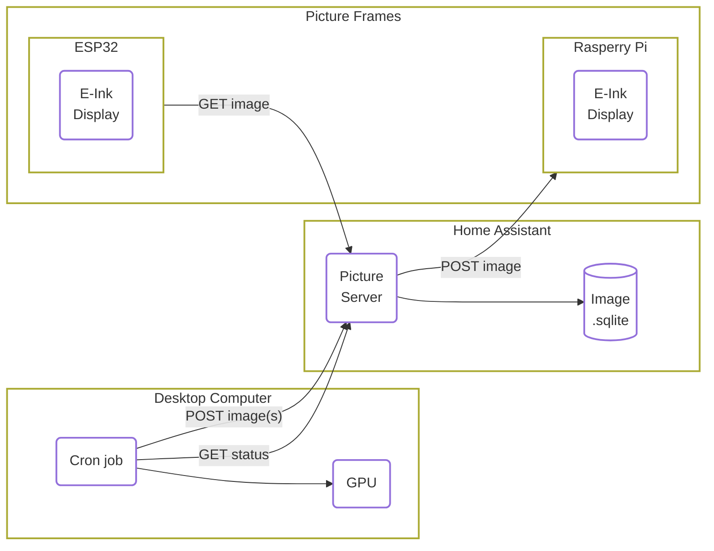

We build a **E-ink** picture **ESP32** frame that displays a new artwork every morning, generated by **local AI diffusion model**.
The content changes daily, so each day brings a completely new and random image to enjoy.
Everything is run locally on our network, ensuring the process is private and keeping everything off the cloud.
Having dynamic, AI-generated art on your walls is straightforward without compromising privacy.
This setup naturally extends our Home Assistant smart home setup, which hosts the image server and monitors the ESP32s.

TODO Insert image gif

Want to build your own? Here is the recipe.
If you want wireless picture frames, you would want to use an ESP32 chip, which requires some soldering.
You can build it with a Raspberry Pi Zero if you don't want to solder.

TODO Insert image from the backside

## Hardware Requirements

You will need

- A computer with a relatively good graphics card, to generate AI images
- E-ink screen and e-ink screen HAT
- if wireless/battery-based; an ESP32 chip and LiPo battery
- if wire-based/non-soldering, a Raspberry Pi Zero
- Optionally, a Raspberry Pi 5 to host an image server

And you will need to be comfortable with

- Python Programming
- Basic Linux skills (shell)
- Soldering

A Raspberry Pi Zero is preferred for the picture frame because of its dimensions, but any Raspberry Pi will work.

> **IMPORTANT**: When shopping for ESP32, if you want to download images over Wi-Fi/the internet via ESPHome, you need a chipset with PSRAM, which is an external memory module allocated to one of the GPIO pins. The WiFi image downloader module needs this extra memory.

| Item | Product Link |
| --- | --- |
| DFRobot FireBeetle2 ESP32S3 N16R8 8MB PSRAM [wiki](https://wiki.dfrobot.com/SKU_DFR0975_FireBeetle_2_Board_ESP32_S3) | [https://www.dfrobot.com/product-2676.html](https://www.dfrobot.com/product-2676.html)|
| DFRobot FireBettle2 ESP32-E N16R2 2M PSRAM  [wiki](https://wiki.dfrobot.com/_SKU_DFR1139_FireBeetle_2_ESP32_E_N16R2_IoT_Microcontroller) | [https://www.dfrobot.com/product-2837.html](https://www.dfrobot.com/product-2837.html) |
| Raspberry Pi 5 | [https://www.raspberrypi.com/products/raspberry-pi-5/](https://www.raspberrypi.com/products/raspberry-pi-5/) |
| Raspberry Pi Zero | [https://www.raspberrypi.com/products/raspberry-pi-zero/](https://www.raspberrypi.com/products/raspberry-pi-zero/) |
| Waveshare E-ink 13.3" K, with HAT | [https://www.waveshare.com/13.3inch-e-paper-hat-k.htm](https://www.waveshare.com/13.3inch-e-paper-hat-k.htm) |

Estimated total cost per frame $$\approx 200 \text{ EUR}$$ + physical frame.

The choice of ESP32 was made by browsing [https://registry.platformio.org/platforms/platformio/espressif32/boards?version=5.3.0](https://registry.platformio.org/platforms/platformio/espressif32/boards?version=5.3.0) for compatible devices. The version is locked to 5.3.0 because, as of the time of writing, ESPHome uses `platformio=5.3.0'. However, the only main requirement is that the ESP32 needs PSRAM to download the PNG image over WiFi.

Could you try to avoid Amazon when shopping? If you are Swiss-based, check out [bastelgarage.ch](https://www.bastelgarage.ch).
But you can find a small shop in your country that sells most components.
Unfortunately, we couldn't find a supplier that sells the [Waveshare 13.3" black/white e-ink display](https://amzn.to/4im9Wjj), so we ordered it via Amazon.

## Software/Service Overview

To organize everything smoothly and easily manipulate the workflow, we split the tasks into three sections: generating images, storing images, and displaying images.
We use our desktop computer with a graphics card to generate images, either live or as a scheduled job.
We both implemented different versions of the workflow; you can find Jimmy's at [github.com/charnley/eink_art_gallery](https://github.com/charnley/eink_art_gallery) and Peter's at [github.com/pgericson/eink-hub](https://github.com/pgericson/eink-hub).

The workflow is as follows;

- The **picture server** holds a list of AI prompts, each with associated pictures, stored in a SQLite database. For our setup, this is hosted on Home Assistant, but it could be any docker hosting service.
- Every night, the **desktop computer** asks the picture server if there are any prompts without images. For all those prompts, the desktop computer generates new images and sends them to the picture server.
- The picture frame(s) run by **ESP32** will run on a sleep schedule for 24h, waking up at 4 am. Wake up, request a picture, display the picture and go back to sleep.
- The picture frame(s) run by **Raspberry Pi** will host an API for displaying images, which means you can send live notifications/images to that frame.

Overall, the services works very nicely together and can be adopted to one personal needs.

## Why E-ink?

There are is two main reasons, because it looks like an drawing and uses very little power.
But thirdly, it looks really good and I have yet to see anyone realise it is a screen technlogy.

The reason it looks so realistic because, what you are looking at is actual ink.
If you ever use a kindle or [Remarkable Tablet](https://remarkable.com/) you know what I am talking about.
The screen consist of small "pixel" of oil, with different pigments.
The pigments can then be moved up or down with a electromagnet, defining the color of the pixel.

[https://en.wikipedia.org/wiki/E_Ink](https://en.wikipedia.org/wiki/E_Ink)
[https://en.wikipedia.org/wiki/Electronic_paper](https://en.wikipedia.org/wiki/Electronic_paper)

The E-ink provider of choice we found [https://www.waveshare.com/](https://www.waveshare.com/) to have fairly good documentation and prices.
Especially, we liked the 13.3 inch black/white screen fits our needs.

<!-- https://www.waveshare.com/13.3inch-e-paper-hat-k.htm -->

| PIN | Description |
| --- | --- |
| VCC | Power positive (3.3V power supply input) |
| GND | Ground |
| DIN | SPI's MOSI, data input |
| SCLK | SPI's CLK, clock signal input |
| CS | Chip selection, low active |
| DC | Data/Command, low for command, high for data |
| RST | Reset, low active |
| BUSY | Busy status output pin (indicating busy) |
| PWR | Power on/off control |

Non-optional pins
PWR, VCC, GND

Reason this is a good frame, is because it is supported by ESPHome and has many examples.

And Python examples.

## Hosting AI art model

### Note on models

### Note on prompts

### Note on Windows hosting and crong job

Some notes on the prompts and references

High contrast

drawings

Examples that works

Examples that do not work (real images)

example: adventurous scifi structure, forest, swiss alps

example2: += pencil sketch

**Figure:** Showing the results of prompting "scifi building in swiss aps", without (A) and with (B) e-ink friendly keywords, and the results after dithering.

## From gradient to binary photo (dithering)

error diffusion

- why? low res
- why? because default makes it grey
- why? the default is implemented both on esphome and pillow

Many to choose from

link to wiki

reasoning

what?

$$
\begin{bmatrix}
         &                                          & *                                        & \frac{\displaystyle 7}{\displaystyle 16} & \ldots \\
  \ldots & \frac{\displaystyle 3}{\displaystyle 16} & \frac{\displaystyle 5}{\displaystyle 16} & \frac{\displaystyle 1}{\displaystyle 16} & \ldots \\
\end{bmatrix}
$$

$$
\begin{bmatrix}
  &  & *  & \frac{\displaystyle 1}{\displaystyle 8} & \frac{\displaystyle 1}{\displaystyle 8} \\
  \ldots & \frac{\displaystyle 1}{\displaystyle 8} & \frac{\displaystyle 1}{\displaystyle 8} & \frac{\displaystyle 1}{\displaystyle 8} & \ldots \\
  \ldots &  & \frac{\displaystyle 1}{\displaystyle 8} &  & \ldots \\
\end{bmatrix}
$$

**Figure:** How a AI generated picture (A), and the default dithering algorithm (B) can be improved (C).
It might be a little difficult to see, but notice how (B) is more greay than (C).
This is a lot more visually clear when applied on an actual physical low-res e-ink screen.

note on implementation
numpy + numba
python slow!
C fast
numba fast

note on multi-color dithering

- https://en.wikipedia.org/wiki/Floyd%E2%80%93Steinberg_dithering
- https://en.wikipedia.org/wiki/Atkinson_dithering

## Choice of hosting model

RPi and ESP32. Push or pull.

Start with RPi

### Setting up Raspberry Pi API frame

### Setting up ESPHome and ESP32 frame

We could not use the waveshare, as it does not have psram

Why not just write it in C?
It could be done without PNG downloader, in pure binary, but we wanted fast iterations
Choose your battles. ESPHome come with a lot of features out of the box.

idea

basic example for showing a image

> **Note:** To use the image downloader you need vram on your

> **Note:** If your picture is getting less visible the more complicated the picture is, you are using the wrong config

> **Note:** If your picture is not doing the full-refresh, please check your soldering connections

basic example for showing image over wifi

advanced example of showing esphome connection

<b>GPIO Configuration for FireBettle2 ESP32-E</b>

    substitutions:
      device_id: "example_e"
      wifi_ssid: !secret wifi_ssid
      wifi_password: !secret wifi_password
      wake_up_time: "04:00:00"
      image_url: "http://homeassistant.local:8090/displays/queue.png"

      clk_pin: "GPIO18"
      mosi_pin: "GPIO23"
      cs_pin: "GPIO15"
      dc_pin: "GPIO13"
      busy_pin: "GPIO04"
      reset_pin: "GPIO14"

      waveshare_model: "13.3in-k" # or another waveshare model

    esp32:
      board: esp32dev # dfrobot_firebeetle2_esp32e
      framework:
        type: arduino
        version: recommended

    esphome:
      name: eink-frame-${device_id}
      friendly_name: "eink frame ${device_id}"
      platformio_options:
        build_flags: "-DBOARD_HAS_PSRAM"

<b>GPIO Configuration for FireBettle2 ESP3S3</b>

    substitutions:
      device_id: "example_s"
      wifi_ssid: !secret wifi_ssid
      wifi_password: !secret wifi_password
      wake_up_time: "04:00:00"
      image_url: "http://homeassistant.local:8090/displays/queue.png"

      clk_pin: "GPIO12"
      mosi_pin: "GPIO11"
      cs_pin: "GPIO10"
      dc_pin: "GPIO9"
      busy_pin: "GPIO7"
      reset_pin: "GPIO4"

      waveshare_model: "13.3in-k" # or another waveshare model

    esp32:
      board: dfrobot_firebeetle2_esp32s3
      framework:
        type: arduino
        version: recommended

For Configuration of a simple, fetching over wifi and displaying it

    http_request:
      id: fetch_image_request
      timeout: 5s
      useragent: esphome/example_device
      verify_ssl: false

    wifi:
      ssid: !secret wifi_ssid
      password: !secret wifi_password
      on_connect:
        - component.update: my_image

    logger:
      baud_rate: 115200
      level: VERY_VERBOSE

    online_image:
      - url: $image_url
        id: my_image
        format: png
        type: BINARY
        on_download_finished:
          then:
            - component.update: my_display
            - logger.log: "Downloaded image"
        on_error:
          then:
            - logger.log: "Error downloading image"

    spi:
      clk_pin: $clk_pin
      mosi_pin: $mosi_pin

    display:
      - platform: waveshare_epaper
        id: my_display
        cs_pin: $cs_pin
        dc_pin: $dc_pin
        busy_pin: $busy_pin
        reset_pin: $reset_pin
        reset_duration: 200ms
        model: $waveshare_model
        update_interval: never
        lambda: |-
          it.image(0, 0, id(my_image), Color::BLACK, Color::WHITE);
          ESP_LOGD("display", "Image displayed successfully");

    deep_sleep:
      run_duration: 40s
      sleep_duration: 25200s # 7h

and config with ESPHome

<b>ESPHome configuration for; wake-up 4am, fetch image, failure-fallback, send battery status, and sleep</b>

    deep_sleep:
      id: deep_sleep_control
      run_duration: 40sec

    time:
      - platform: homeassistant
        id: homeassistant_time

    logger:
      baud_rate: 115200
      level: DEBUG

    wifi:
      ssid: !secret wifi_ssid
      password: !secret wifi_password
      power_save_mode: light
      on_connect:
        - logger.log: WiFi is connected!
        - logger.log: "Trying to download ${image_url}"
        - component.update: my_image

    captive_portal:

    online_image:
      - url: $image_url
        id: my_image
        format: png
        type: BINARY
        on_download_finished:
          then:
            - logger.log: "Downloaded image, updating display"
            - display.page.show: page1
            - component.update: my_display
            - delay: 7s
            - deep_sleep.enter:
                id: deep_sleep_control
                until: "${wake_up_time}"
                time_id: homeassistant_time
        on_error:
          then:
            - logger.log: "Error downloading image $(image_url)"
            - display.page.show: page2
            - component.update: my_display
            - delay: 7s
            - deep_sleep.enter:
                id: deep_sleep_control
                until: "${wake_up_time}"
                time_id: homeassistant_time

    spi:
      clk_pin: $clk_pin
      mosi_pin: $mosi_pin

    display:
      - platform: waveshare_epaper
        id: my_display
        cs_pin: $cs_pin
        dc_pin: $dc_pin
        busy_pin: $busy_pin
        reset_pin: $reset_pin
        reset_duration: 200ms
        model: $waveshare_model
        update_interval: never
        pages:
          - id: page1
            lambda: |-
              it.image(0, 0, id(my_image), Color::BLACK, Color::WHITE);
              ESP_LOGD("display", "Image displayed successfully");
          - id: page2
            lambda: |-
              it.line(0, 0, 50, 50);
              it.line(0, 50, 50, 0);
              ESP_LOGD("display", "Error Image displayed successfully");

    api:
       on_client_connected:
         then:
           - sensor.template.publish:
               id: battery_level
               state: !lambda "return id(battery_level).state;"
           - sensor.template.publish:
               id: battery_voltage
               state: !lambda "return id(battery_voltage).state;"

    ota:
      - platform: esphome

     sensor:
       - platform: adc
         pin: VDD
         name: "Battery Voltage"
         id: battery_voltage
         update_interval: 60s
         attenuation: auto
         unit_of_measurement: "V"
         accuracy_decimals: 2

       - platform: template
         name: "Battery Level"
         id: battery_level
         unit_of_measurement: "%"
         accuracy_decimals: 0
         lambda: |-
           float voltage = id(battery_voltage).state;
           if (voltage < 3.0) return 0;
           if (voltage > 4.2) return 100;
           return (voltage - 3.0) / (4.2 - 3.0) * 100.0;

    binary_sensor:
      - platform: status
        name: "${device_id} Status"
        id: device_status

## Battery choice

With a little measurement and googling, 

- 1-5% selvafladning om måneden for Litihium batterier?!
- Usage is 0.5 mAh or 2 mWh per picture turn.
- Peak is 0.128 A and lasts for about 20s

Watt is equal to 1 joule per second

Power consumption in Deep-sleep mode is 10 μA
cite: https://www.espressif.com/sites/default/files/documentation/esp32_datasheet_en.pdf

24h = 86400s

$$
\begin{align}
     E_\text{Battery} &= \frac{\text{[Battery mAh]} \cdot \text{[Battery Voltage]}}{1000} \cdot 3600 \text{ Joule / Wh}\\
     &= \left (1500 \text{mAh} \cdot 3.7 \text{V} \right ) / 1000 \cdot 3600 \text{J/Wh} = \underline{19980 \text{ Joule}}\\
    E_\text{picture change} &= \text{Voltage} \cdot \text{Ampere} \cdot \text{Time}\\
    &= 3.7 \text{V} \cdot 0.128\text{A} \cdot 20\text{sec} = \underline{9.5 \text{ Joule}}\\
    E_\text{daily sleep} &= 3.7 \text{V} \cdot 0.00001 \text{A} \cdot 86400 \text{sec} = \underline{3.2 \text{ Joule}}\\
    \text{Battery Life} &= \frac{E_\text{Battery} }{(E_\text{daily sleep} + N \cdot E_\text{picture change})} \\
                 &= \frac{19980 \text{ J}}{\left (3.2 + 1 \cdot 9.5 \right ) \text{J/day}} \approx 1500 \text{ days} \approx 4 \text{ years}
\end{align}
$$

Where $$N$$ is number of picture changes per day. In our example it is just once per night.

## Mounting on the frame

Peter's 3D printing

- [ ] TODO Jimmy's hot glue method, with M2 screw and spacers

m2 x5mm screws
m2 x5mm spacer
hot glue
place the spacer and screw onto the device. hot glue to the backside of the picture frame

## Bring it all together

Result and comment

Frame notes
passepartout
passe-partout

The default 30x40cm passe-partout I could get locally, was just showing the black outline of the screen, so I went to a local book binder and had custom made.
It was expensive, but worth it for the final touch.

## Note on the next version

- Zigbee-based update
- The new Waveshare screen
- Auto AI generated prompts based on themes and events
- Generate AI art of your friends when they visit
- Home Assistant updates the timer and picture url from variables
- Home Assistant can send notification, such as weather or ski
- Better infographics, such as weather in local area

## Known issues

- Why do we need to revert the colors for the esphome setup?
- Soldering could be an issue, check
- Check which config you need to set the HAT
- Not on grey levels on e-ink
- Not on the black-white-red screen
- Check the +/- on the lipo battery, needs to fit. You might need to change it.

## References

- Dithering references
- AI art references
- ESP32 references

## Thanks

Ananda for providing answers when stuck.
Kristoffer for proofreading.

- [ ] TODO: insert images of the frame, front and back, with a gif for when it changes the image to show what it can do.
- [ ] TODO: explain what it is before why
- [ ] TODO: performance expectations( image fresh, battery life)
- [ ] TODO: cost
- [ ] TODO: Hardware for the product
- [ ] TODO: software for the product
- [ ] TODO: tools to get it done, need to have, and nice to have category
- [ ] TODO: skill required on the hardware side
- [ ] TODO: skill required on the software side
