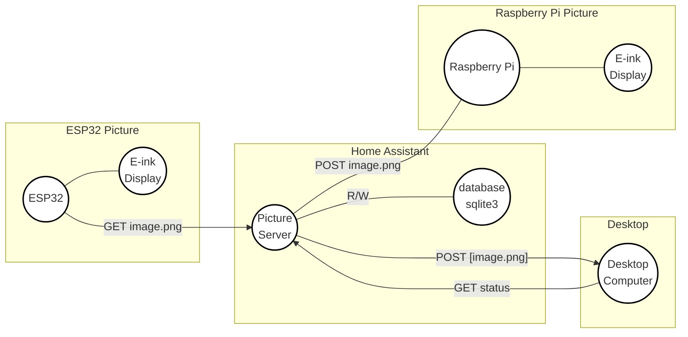

I want to build a home e-ink based picture, where the content is generated by AI diffusion models.
So every morning I will have new art and wonder "what is that?".
I also require that the whole project is done locally on my own local network, because nobody needs to know what I have on my walls.

This is a project that we started in Feb 2024, and took some interations before we got it right.
In the mean time many commercial products has appeared.
TODO Insert examples

## Overview

TODO Insert toplogy graph overview of the services and explain

## Why E-ink?

There are is two main reasons, because it looks like an drawing and uses very little power.
But thirdly, it looks really good and I have yet to see anyone realise it is a screen technlogy.

The reason it looks so realistic because, what you are looking at is actual ink.
If you ever use a kindle or [Remarkable Tablet](https://remarkable.com/) you know what I am talking about.
The screen consist of small "pixel" of oil, with different pigments.
The pigments can then be moved up or down with a electromagnet, defining the color of the pixel.

[https://en.wikipedia.org/wiki/E_Ink](https://en.wikipedia.org/wiki/E_Ink)
[https://en.wikipedia.org/wiki/Electronic_paper](https://en.wikipedia.org/wiki/Electronic_paper)

The E-ink provider of choice we found [https://www.waveshare.com/](https://www.waveshare.com/) to have fairly good documentation and prices.
Especially, we liked the 13.3 inch black/white screen fits our needs.

<!-- https://www.waveshare.com/13.3inch-e-paper-hat-k.htm -->

| PIN | Description |
| --- | --- |
| VCC | Power positive (3.3V power supply input) |
| GND | Ground |
| DIN | SPI's MOSI, data input |
| SCLK | SPI's CLK, clock signal input |
| CS | Chip selection, low active |
| DC | Data/Command, low for command, high for data |
| RST | Reset, low active |
| BUSY | Busy status output pin (indicating busy) |
| PWR | Power on/off control |

## Choice of AI art

Some notes on the prompts and references

High contrast

drawings

Examples that works

Examples that do not work (real images)

## Choice of dithering

- why? low res
- why? because default makes it grey

TODO Examples

## Choice of hosting model

RPi and ESP32. Push or pull.

Start with RPi

## Using ESPHome and ESP32

idea

basic example for showing a image

> **Note:** To use the image downloader you need vram on your

> **Note:** If your picture is getting less visible the more complicated the picture is, you are using the wrong config

> **Note:** If your picture is not doing the full-refresh, please check your soldering connections

basic example for showing image over wifi

advanced example of showing esphome connection

<b>GPIO Configuration for FireBettle</b>

| PIN | ESP32 | Description |
| --- | --- | --- |
| VCC | 3V3 | Power positive (3.3V power supply input) |
| GND | GND | Ground |
| DIN | | SPI's MOSI, data input |
| SCLK | | SPI's CLK, clock signal input |
| CS | | Chip selection, low active |
| DC | | Data/Command, low for command, high for data |
| RST | | Reset, low active |
| BUSY | | Busy status output pin (indicating busy) |

<b>GPIO Configuration for Y</b>

| PIN | ESP32 | Description |
| --- | --- | --- |
| VCC | 3V3 | Power positive (3.3V power supply input) |
| GND | GND | Ground |
| DIN | | SPI's MOSI, data input |
| SCLK | | SPI's CLK, clock signal input |
| CS | | Chip selection, low active |
| DC | | Data/Command, low for command, high for data |
| RST | | Reset, low active |
| BUSY | | Busy status output pin (indicating busy) |

## Battery choice

With a little measurement and googling, 

Usage is 0.5 mAh or 2 mWh per picture turn.
Peak is 0.128 A and lasts for about 20s

Watt is equal to 1 joule per second

Power consumption in Deep-sleep mode is 10 μA
cite: https://www.espressif.com/sites/default/files/documentation/esp32_datasheet_en.pdf

$$
    Battery energy = 1500 [mAh] * 3.7 [v] / 1000 * 3600 [J / Wh] = 19980 [Joule]
$$

$$
    Energy per usage = 3.7 [V] * 0.128 A * 20 [sec] = 9.472 [Joule]
$$

24h = 86400s

$$
    Sleep usage = 3.7 v * 0.00001 A * 86400 [s] = 3.2 [Joule]
$$

$$ 
    Battery Life = Battery energy (J) / (sleep energy + change energy * N)
                 = (19980 J) / (3.2 J + 9.472 J) = 1576 days ~= 4 years
$$

$$
\[
\begin{align}
E &= mc^2 \nonumber \\
E^2 &= m^2p^2 + m^2c^4 \nonumber
\end{align}
\]
$$

## 3D printed backside?

## Bring it all together

Result and comment

## Shopping List

| Item | Amazon Link | Swiss link |
| --- | --- | --- |
| ESP32 | X | Y |
| Waveshare 13.3" K | X | Y |

## Note on the next version

- Zigbee
- The new Waveshare screen
- Generate AI art of your friends when they visit

## References

- Dithering references
- AI art references
- ESP32 references

