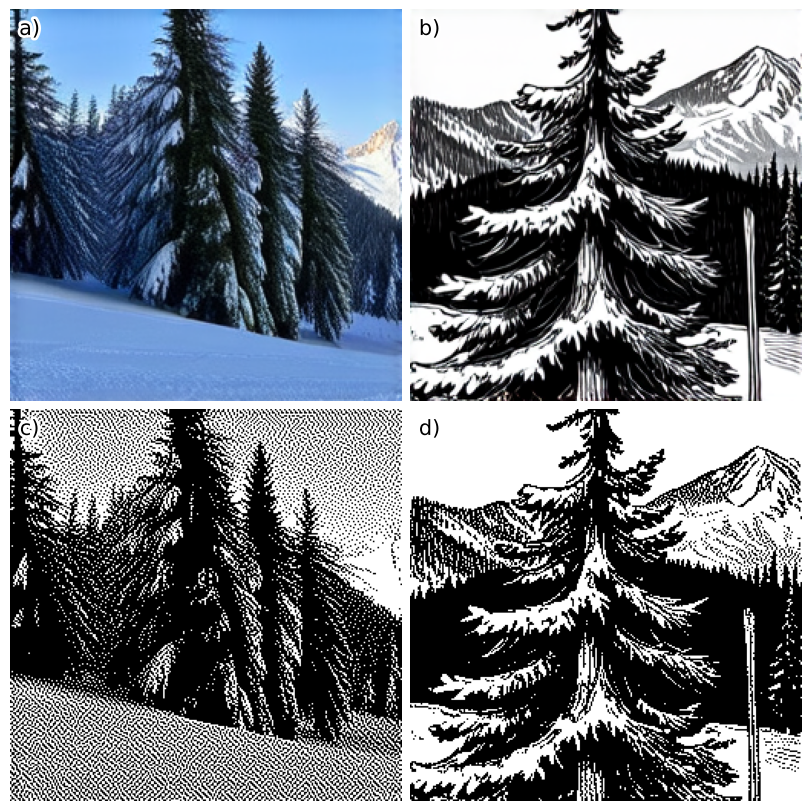
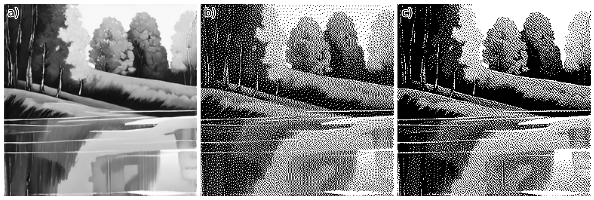

We build a **E-ink** picture **ESP32** frame that displays a new artwork every morning, generated by **local AI diffusion model**.
The content changes daily, so each day brings a completely new and random image to enjoy.
Everything is run locally on our network, ensuring the process is private and keeping everything off the cloud.
Having dynamic, AI-generated art on your walls is straightforward without compromising privacy.
This setup naturally extends our Home Assistant smart home setup, which hosts the image server and monitors the ESP32s.

In some places we dive deep (e.i. dithering algorithms); other places, we take shortcuts (e.i. not writing C-code), 
because [we need to finish our projects](https://www.youtube.com/watch?v=4jgTCayWlwc).


Want to build your own? Here is the recipe.
If you want wireless picture frames, you would want to use an ESP32 chip, which requires some soldering.
You can build it with a Raspberry Pi Zero if you don't want to solder.


**Figure:** Backside of the photoframe, showing the ESP32, E-ink hat and Battery. Including a 1EUR and 2EUR for size reference.

## Hardware Requirements

You will need

- A computer with a relatively good graphics card, to generate AI images
- E-ink screen and e-ink screen HAT
- if wireless/battery-based; an ESP32 chip and LiPo battery
- if wire-based/non-soldering, a Raspberry Pi Zero
- Optionally, a Raspberry Pi 5 to host an image server

And you will need to be comfortable with

- Python Programming
- Basic Linux skills (shell)
- Soldering

A Raspberry Pi Zero is preferred for the picture frame because of its dimensions, but any Raspberry Pi will work.

> **IMPORTANT**: When shopping for ESP32, if you want to download images over Wi-Fi/the internet via ESPHome, you need a chipset with PSRAM, which is an external memory module allocated to one of the GPIO pins. The WiFi image downloader module needs this extra memory.


| Item | Product Link | Price |
| --- | --- | --- |
| DFRobot FireBeetle2 ESP32S3 N16R8 8MB PSRAM [wiki](https://wiki.dfrobot.com/SKU_DFR0975_FireBeetle_2_Board_ESP32_S3) | [https://www.dfrobot.com/product-2676.html](https://www.dfrobot.com/product-2676.html)| ~ 20 EUR |
| DFRobot FireBettle2 ESP32-E N16R2 2M PSRAM  [wiki](https://wiki.dfrobot.com/_SKU_DFR1139_FireBeetle_2_ESP32_E_N16R2_IoT_Microcontroller) | [https://www.dfrobot.com/product-2837.html](https://www.dfrobot.com/product-2837.html) | ~ 15 EUR |
| 1500-5000 mAh LiPo Battery with JST PH 2 Pin connector | | ~ 7 EUR |
| Raspberry Pi 5 | [https://www.raspberrypi.com/products/raspberry-pi-5/](https://www.raspberrypi.com/products/raspberry-pi-5/) | ~120 EUR |
| Raspberry Pi Zero | [https://www.raspberrypi.com/products/raspberry-pi-zero/](https://www.raspberrypi.com/products/raspberry-pi-zero/) | ~12 EUR |
| Waveshare E-ink 13.3" K, with HAT | [https://www.waveshare.com/13.3inch-e-paper-hat-k.htm](https://www.waveshare.com/13.3inch-e-paper-hat-k.htm) | ~150 EUR |

Estimated total cost per frame $$\approx 200 \text{ EUR}$$ + physical frame, with the e-ink display being the most costly part.

The choice of ESP32 was made by browsing [https://registry.platformio.org/platforms/platformio/espressif32/boards?version=5.3.0](https://registry.platformio.org/platforms/platformio/espressif32/boards?version=5.3.0) for compatible devices. The version is locked to 5.3.0 because, as of the time of writing, ESPHome uses `platformio=5.3.0'. However, the only main requirement is that the ESP32 needs PSRAM to download the PNG image over WiFi.

Could you try to avoid Amazon when shopping? If you are Swiss-based, check out [bastelgarage.ch](https://www.bastelgarage.ch).
But you can find a small shop in your country that sells most components.
Unfortunately, we couldn't find a supplier that sells the [Waveshare 13.3" black/white e-ink display](https://amzn.to/4im9Wjj), so we ordered it via Amazon.

## Software/Service Overview

To organize everything smoothly and easily manipulate the workflow, we split the tasks into three sections: generating images, storing images, and displaying images.
We use our desktop computer with a graphics card to generate images, either live or as a scheduled job.
We both implemented different versions of the workflow; you can find Jimmy's at [github.com/charnley/eink_art_gallery](https://github.com/charnley/eink_art_gallery) and Peter's at [github.com/pgericson/eink-hub](https://github.com/pgericson/eink-hub).


The workflow is as follows;

- The **picture server** holds a list of AI prompts, each with associated pictures, stored in a SQLite database. For our setup, this is hosted on Home Assistant, but it could be any docker hosting service.
- Every night, the **desktop computer** asks the picture server if there are any prompts without images. For all those prompts, the desktop computer generates new images and sends them to the picture server.
- The picture frame(s) run by **ESP32** will run on a sleep schedule for 24h, waking up at 4 am. Wake up, request a picture, display the picture and go back to sleep.
- The picture frame(s) run by **Raspberry Pi** will host an API for displaying images, which means you can send live notifications/images to that frame.

Overall, the services works very nicely together and can be adopted to one personal needs.

## Why E-ink?

There are is two main reasons, because it looks like an drawing and uses very little power.
But secondly, it looks really good and I have yet to see anyone realise it is a screen technlogy without explanation.
An explanation I would happily give without prompt.

The reason it looks so realistic because, what you are looking at is actual ink.
If you ever use a kindle or [Remarkable Tablet](https://remarkable.com/) you know what I am talking about.
The screen consist of small "pixel" of oil, with different pigments.
The pigments can then be moved up or down with a electromagnet, defining the color of the pixel.
What to know more?
Read it on [wikipedia.org/wiki/E_Ink](https://en.wikipedia.org/wiki/E_Ink) and [wikipedia.org/wiki/Electronic_paper](https://en.wikipedia.org/wiki/Electronic_paper).

There are quite a few provioders out there, but the E-ink provider of choice we found is [waveshare.com](https://www.waveshare.com/).
We choose them because others have had success with them and they have fairly good documentation and prices.
Especially, we liked the 13.3 inch black/white screen fits our needs. Price vs size-wise.
[waveshare.com/13.3inch-e-paper-hat-k.htm](https://www.waveshare.com/13.3inch-e-paper-hat-k.htm).
The prices can very quickly grow with size, however we didn't want to go with the standard 7.5" as it would seem very small on a wall.
Much rather compromise and have a larger but low-resolution black/white screen.
With the size, and even with the low resolution, it fits well, and blends well into the livingroom space.

The way the screen works is via GPIO pins and binary commands.
For the Raspberry Pi, this is plug-and-play integration.
For the ESP32, you will have to solder each pin and configure the GPIO setup.

| PIN | Description |
| --- | --- |
| VCC | Power positive (3.3V power supply input) |
| GND | Ground |
| DIN | SPI's MOSI, data input |
| SCLK | SPI's CLK, clock signal input |
| CS | Chip selection, low active |
| DC | Data/Command, low for command, high for data |
| RST | Reset, low active |
| BUSY | Busy status output pin (indicating busy) |
| PWR | Power on/off control |

For soldering the configuration it is mostly free to choose which pins goes where.
However, obviously VCC and GND is not.
The PWR pin is a new addition to the HAT, which controls the power of the e-ink screen.
Easiest configuration here is to solder it diretly to a 3v3 endpoint on the ESP32.

Another reason why this brand of e-ink is a good choice, is because ESPHome drivers exist for it, making it faster to get something up.
And many examples are outthere.
However most of the examples are for 7.5".

## Hosting AI art model

To fill the local image library we created a Python environment on our desktop computer with access to a graphicscard/GPU.
To have a super powerfull graphics card is not so important, unless you want live prompts.
For a nightly cronjob, it doesn't matter that image generation takes 20 mins or more.

### Selecting an AI model

You can really choose whatever you want here.
We iterated through many models, always trying out the newest during 2024, but in the end for this project, it didn't really matter.
In the end we selected
[Stable Diffusion 3.5](https://stability.ai/news/introducing-stable-diffusion-3-5),
because of easy of setup and what our hardware could handle.
For 1080p graphicscard, it takes about 15mins per image, and with a 4090 it takes ... 3s.
We used Huggingface to setup the model, which requires you to register to get access to the model.

### Note on prompts

For prompts, there are som lessons learned. The biggest lesson is, if you want the art to look nice on the black/white e-ink screen,
you need to use styles that fit that format. E.i. high contrast, grey-scaled and preferably prompt with a e-ink friendly style.

For example, when prompting for a 
"adventurous scifi structure, forest, swiss alps"
the diffusion model will most likely default to a picture/realistic style, which does not translate well to e-ink.
You will need to add something like "pencil sketch" or "ink droplet style" to the prompt to guide the style towards something that looks 
nice on the screen.
Anything drawing, painting, sketch related usually translates well


**Figure:** Showing the results of prompting "scifi building in swiss aps", without (A) and with (B) e-ink friendly keywords, and the results after dithering.

For inspiration, there are many style libraries that has been created. We found that [midlibrary.io](https://midlibrary.io/) gave a quite good selection of style and artists that works well.
Especially the black and white section.

### Hosting image generator service on windows

Since you are following this setup guide, I assume you have a graphics card, and then I will also assume that you are using it on a windows machine.
The most easy way to setup a service is to setup Windows Subsystem Linux.

There was some problems with speed with Windows10 and WSL2, as the read/write to desk was very slow.
Using Windows11 with WSL2 seems way more stable. And note that you need more space than you think to have a Linux subsystem.
However, my experience is with Win11 and WSL2, getting CUDA access to to your windows GPU from linux, is quite smooth.
Setup guide is as following

<details markdown="1">
<summary><b>Setup Linux subsystem linux with CUDA</b></summary>

- Install cuda on windows (probably you already have that) [developer.nvidia.com/cuda-downloads](https://developer.nvidia.com/cuda-downloads)
- Install wsl [learn.microsoft.com/en-us/windows/wsl/install](https://learn.microsoft.com/en-us/windows/wsl/install)

Open a terminal and install wsl

    wsl --install

When WSL is installed, update and setup linux

    # update apt
    sudo apt update
    sudo apt upgrade

Download CUDA bridge from Select Linux, x86, WSL-Ubuntu, 2.0, deb (network)
[developer.nvidia.com/cuda-downloads?target_os=Linux&target_arch=x86_64&Distribution=WSL-Ubuntu&target_version=2.0&target_type=deb_network](https://developer.nvidia.com/cuda-downloads?target_os=Linux&target_arch=x86_64&Distribution=WSL-Ubuntu&target_version=2.0&target_type=deb_network)
as of writing this means
Which means today running the following commands in WSL Ubuntu

```bash
wget https://developer.download.nvidia.com/compute/cuda/repos/wsl-ubuntu/x86_64/cuda-keyring_1.1-1_all.deb
sudo dpkg -i cuda-keyring_1.1-1_all.deb
sudo apt update
sudo apt -y install cuda-toolkit-12-3
```

and lastly setup python, either with `conda`, `uv` or `pip`.

</details>

And with that you should be able to use a Python environment with CUDA in a linux environment, hosted by Windows.

With the linux subsystem we can setup a job for our service to run every 4am. 
Setup a cronjob with `crontab -e` with the following syntax

```crontab
30 4 * * * cd ~/path/to/project && start-service
```

## Dithering, from a grey-scale photo to binary-black/white

When translating a photo from grey-scale to black-white (meaning binary here), we need to account for the error when we cannot represent grey.
This is called [error diffusion/dithering](https://en.wikipedia.org/wiki/Dither) and is a well known issue.
The default dithering algorithm on most systems is [Floyd-Steinberg dithering](https://en.wikipedia.org/wiki/Floyd%E2%80%93Steinberg_dithering),
which is the most numerical accucate way of doing it.
It works by splitting the error associated with going from grey to either black or white into the neighboring pixels, moving from top left.
So if $$*$$ is the current pixel, the error would be distributed like this;

$$
\begin{bmatrix}
         &                                          & *                                        & \frac{\displaystyle 7}{\displaystyle 16} & \ldots \\
  \ldots & \frac{\displaystyle 3}{\displaystyle 16} & \frac{\displaystyle 5}{\displaystyle 16} & \frac{\displaystyle 1}{\displaystyle 16} & \ldots \\
\end{bmatrix}
$$

However, in practice, the numerically correct method dithers the error very densely, making the picture look greyish.
This is especially prominent in our low-resolution images/displays.

With experience we found that the algorithm used in old Macs, [Atkinson Dithering](https://en.wikipedia.org/wiki/Atkinson_dithering),
works really well for low resolution photos.
The difference being that instead of diffusing the full error, only partial will be diffused.

$$
\begin{bmatrix}
  &  & *  & \frac{\displaystyle 1}{\displaystyle 8} & \frac{\displaystyle 1}{\displaystyle 8} \\
  \ldots & \frac{\displaystyle 1}{\displaystyle 8} & \frac{\displaystyle 1}{\displaystyle 8} & \frac{\displaystyle 1}{\displaystyle 8} & \ldots \\
  \ldots &  & \frac{\displaystyle 1}{\displaystyle 8} &  & \ldots \\
\end{bmatrix}
$$

The result is that the image will have more concentrated pixel areas and have a higher contrast. As seen by the following comparison.


**Figure:** A greyscale image (A), dithering using Floyd-Steinberg (B) and using Atkinson Dithering (C).

It might be a little difficult to see, but notice how (B) is more greay than (C).
This is a lot more visually clear when applied on an actual physical low-res e-ink screen.

Now the implementation is doing a lot of for-loops, so Python is not really the best option.
And Pillow only implemented Floyd-Steinberg. 
But using Numba we can get something working really quick.

<details markdown="1">
<summary><b>Atkinson Dithering Python Implementations</b></summary>

```python
import numpy as np
from numba import jit
from PIL import Image

def atkinson_dither(image: Image.Image) -> Image.Image:
    img = np.array(image.convert("L"), dtype=np.int32)
    set_atkinson_dither_array(img)
    return Image.fromarray(np.uint8(img))

@jit
def set_atkinson_dither_array(img: np.ndarray):
    """changes img array with atkinson dithering"""

    low = 0
    heigh = 255

    frac = 8  # Atkinson constant
    neighbours = np.array([[1, 0], [2, 0], [-1, 1], [0, 1], [1, 1], [0, 2]])
    threshold = np.zeros(256, dtype=np.int32)
    threshold[128:] = 255
    height, width = img.shape
    for y in range(height):
        for x in range(width):
            old = img[y, x]
            old = np.min(np.array([old, 255]))
            new = threshold[old]
            err = (old - new) // frac
            img[y, x] = new
            for dx, dy in neighbours:
                nx, ny = x + dx, y + dy
                if 0 <= nx < width and 0 <= ny < height:
                    # Make sure that img set is between 0 and 255 (negative error could surpass the value)
                    img_yx = img[ny, nx] + err
                    img_yx = np.minimum(heigh, np.maximum(img_yx, low))
                    img[ny, nx] = img_yx
```

</details>

If you are doing multiple colors you can diffuse the error per color channel.

## Displaying the image

For displaying the image on the e-ink, we have two options. Push, with powercable, or pull with battery.

Personally, the iteration was done with a Raspberry Pi, but given that required a USB power cable it removed the immersion as a photoframe.
Note that a white USB cable was used and only one person ever noticed it. However, we knew it was there, and that was enough.
But if you want live updates, like a notification, this is the option you want.

The second option is to use an ESP32 microprocessor, which can be battery-powered. No visible cords.

### Setting up Raspberry Pi API frame

For the Raspberry Pi, the simplest setup would be to setup a FastAPI Python client to receive request and display them.
We use an [Raspberry Pi Zero](https://www.raspberrypi.com/products/raspberry-pi-zero/) because of the small form-factor, to be hidden behind the frame.
Waveshare provides quite good example codes for Python (And other implementations), and is easily the fastest way to get something shown on your screen.
[github.com/waveshareteam/e-Paper](https://github.com/waveshareteam/e-Paper). 

For the Raspberry Pi, [install Debian OS](https://www.raspberrypi.com/documentation/computers/getting-started.html) and `ssh` into the it. 

<details markdown="1">
<summary><b>Setting up Raspberry Pi</b></summary>

```bash
# Enable SPI
# Choose Interfacing Options -> SPI -> Yes
sudo raspi-config
sudo reboot

# Setup Python and dependencies
sudo apt install python3-pip python3-setuptools python3-venv python3-wheel libopenjp2-7

# Create a python env
python3 -m venv project_name

# Activate python env
source ./project_name/bin/activate

# Install the main dependencies with the activated env, but really, use a git repo for this
pip install pillow numpy RPi.GPIO spidev gpiozero spidev
```
</details>

If you have a problem creating a `venv`, because of missing pip, you can;

    python3 -m venv --without-pip project_name
    source env/bin/activate
    wget bootstrap.pypa.io/get-pip.py
    python get-pip.py

With this setup, it should be pretty straightforward to set up a FastAPI solution.
For inspiration, refer to Jimmy's github solution [github.com/charnley/eink_art_gallery](https://github.com/charnley/eink_art_gallery).

Note, because you need to start the API every time the Raspberry Pi is booted, it is worth setting up a `crontab -e` to start you service at boot

    @reboot /path/to/your_script.sh


### Setting up ESPHome and ESP32 frame

Why didn't we write it in C?
Because A) the project needs to end at some point, and B) we both use Home Assistant, it made sense to get all the free stuff out of the box with ESPHome.
[Choose your battles](https://www.youtube.com/watch?v=4jgTCayWlwc) and finish your projects.

There are many, many, many options for ESP32s.
Firstly, we tried the example [ESP32 development board](https://www.waveshare.com/e-paper-esp32-driver-board.htm) from Waveshare, which, of course, can display pictures. However, it was not possible to download images over the Internet with the standard ESPHome libraries. 
Because this requires that the ESP32 has [PSRAM](https://docs.espressif.com/projects/esp-idf/en/latest/esp32/api-guides/external-ram.html).
We iterated through a couple and found that the FireBettle2 ESP32-E and FireBettle2 ESP32S have PSRAM and are well-documented by the producer.

> **Note:** If your picture gets less visible (greyish), the more complicated the image is, you are using the wrong display-config. [waveshare.com/wiki/E-Paper_Driver_HAT](https://www.waveshare.com/wiki/E-Paper_Driver_HAT).

> **Note:** If your picture does not refresh entirely when changing photos, you might have a loose connection. Check your soldering connections.

To connect the ESP32 to the E-Paper Driver HAT, select which GPIO pins are connected to each pin defined for the Waveshare HAT (table above).
So, solder solder. Remember your flux.
The configuration that worked for us was (as defined by the yaml esphome-substitutions);

<details markdown="1">
<summary><b>GPIO Configuration for FireBettle2 ESP32-E</b></summary>

```yaml
substitutions:
  device_id: "example_e"
  wifi_ssid: !secret wifi_ssid
  wifi_password: !secret wifi_password
  wake_up_time: "04:00:00"
  image_url: "http://homeassistant.local:8090/displays/queue.png"

  clk_pin: "GPIO18"
  mosi_pin: "GPIO23"
  cs_pin: "GPIO15"
  dc_pin: "GPIO13"
  busy_pin: "GPIO04"
  reset_pin: "GPIO14"

  waveshare_model: "13.3in-k" # or another waveshare model

esp32:
  board: esp32dev # dfrobot_firebeetle2_esp32e
  framework:
    type: arduino
    version: recommended

esphome:
  name: eink-frame-${device_id}
  friendly_name: "eink frame ${device_id}"
  platformio_options:
    build_flags: "-DBOARD_HAS_PSRAM"
```

</details>

<details markdown="1">
<summary><b>GPIO Configuration for FireBettle2 ESP3S3</b></summary>

```yaml
substitutions:
  device_id: "example_s"
  wifi_ssid: !secret wifi_ssid
  wifi_password: !secret wifi_password
  wake_up_time: "04:00:00"
  image_url: "http://homeassistant.local:8090/displays/queue.png"

  clk_pin: "GPIO12"
  mosi_pin: "GPIO11"
  cs_pin: "GPIO10"
  dc_pin: "GPIO9"
  busy_pin: "GPIO7"
  reset_pin: "GPIO4"

  waveshare_model: "13.3in-k" # or another waveshare model

esp32:
  board: dfrobot_firebeetle2_esp32s3
  framework:
    type: arduino
    version: recommended
```

</details>

To flash it, install esphome with;

```bash
pip install esphome
```

Setup a `secrets.yaml`

```yaml
wifi_ssid: YourWiFiSSID
wifi_password: YourWiFiPassword
```

Then, you flash the ESP with ESPHome using the command;

```bash
esphome run --device /dev/ttyACM0 ./configuration.yaml
```

Where the device is mounted on either `/dev/ttyACM0-2` or `/dev/ttyUSB0-2`.
You need to define the device argument; otherwise, ESPHome will try to flash the device over the ethernet using the device ID.

With the GPIO soldered and configured, we can try different ESPHome configurations.
Prepend the above GPIO configuration to the configuration you want to flash.

For Configuration of a simple, fetching image over wifi and displaying it;

```yaml
http_request:
  id: fetch_image_request
  timeout: 5s
  useragent: esphome/example_device
  verify_ssl: false

wifi:
  ssid: !secret wifi_ssid
  password: !secret wifi_password
  on_connect:
    - component.update: my_image

logger:
  baud_rate: 115200
  level: VERY_VERBOSE

online_image:
  - url: $image_url
    id: my_image
    format: png
    type: BINARY
    on_download_finished:
      then:
        - component.update: my_display
        - logger.log: "Downloaded image"
    on_error:
      then:
        - logger.log: "Error downloading image"

spi:
  clk_pin: $clk_pin
  mosi_pin: $mosi_pin

display:
  - platform: waveshare_epaper
    id: my_display
    cs_pin: $cs_pin
    dc_pin: $dc_pin
    busy_pin: $busy_pin
    reset_pin: $reset_pin
    reset_duration: 200ms
    model: $waveshare_model
    update_interval: never
    lambda: |-
      it.image(0, 0, id(my_image), Color::BLACK, Color::WHITE);
      ESP_LOGD("display", "Image displayed successfully");

deep_sleep:
  run_duration: 40s
  sleep_duration: 25200s # 7h
```

and config with ESPHome

<details markdown="1">
<summary><b>ESPHome configuration for; wake-up 4am, fetch image, failure-fallback, send battery status, and sleep</b></summary>

    deep_sleep:
      id: deep_sleep_control
      run_duration: 40sec

    time:
      - platform: homeassistant
        id: homeassistant_time

    logger:
      baud_rate: 115200
      level: DEBUG

    wifi:
      ssid: !secret wifi_ssid
      password: !secret wifi_password
      power_save_mode: light
      on_connect:
        - logger.log: WiFi is connected!
        - logger.log: "Trying to download ${image_url}"
        - component.update: my_image

    captive_portal:

    online_image:
      - url: $image_url
        id: my_image
        format: png
        type: BINARY
        on_download_finished:
          then:
            - logger.log: "Downloaded image, updating display"
            - display.page.show: page1
            - component.update: my_display
            - delay: 7s
            - deep_sleep.enter:
                id: deep_sleep_control
                until: "${wake_up_time}"
                time_id: homeassistant_time
        on_error:
          then:
            - logger.log: "Error downloading image $(image_url)"
            - display.page.show: page2
            - component.update: my_display
            - delay: 7s
            - deep_sleep.enter:
                id: deep_sleep_control
                until: "${wake_up_time}"
                time_id: homeassistant_time

    spi:
      clk_pin: $clk_pin
      mosi_pin: $mosi_pin

    display:
      - platform: waveshare_epaper
        id: my_display
        cs_pin: $cs_pin
        dc_pin: $dc_pin
        busy_pin: $busy_pin
        reset_pin: $reset_pin
        reset_duration: 200ms
        model: $waveshare_model
        update_interval: never
        pages:
          - id: page1
            lambda: |-
              it.image(0, 0, id(my_image), Color::BLACK, Color::WHITE);
              ESP_LOGD("display", "Image displayed successfully");
          - id: page2
            lambda: |-
              it.line(0, 0, 50, 50);
              it.line(0, 50, 50, 0);
              ESP_LOGD("display", "Error Image displayed successfully");

    api:
       on_client_connected:
         then:
           - sensor.template.publish:
               id: battery_level
               state: !lambda "return id(battery_level).state;"
           - sensor.template.publish:
               id: battery_voltage
               state: !lambda "return id(battery_voltage).state;"

    ota:
      - platform: esphome

     sensor:
       - platform: adc
         pin: VDD
         name: "Battery Voltage"
         id: battery_voltage
         update_interval: 60s
         attenuation: auto
         unit_of_measurement: "V"
         accuracy_decimals: 2

       - platform: template
         name: "Battery Level"
         id: battery_level
         unit_of_measurement: "%"
         accuracy_decimals: 0
         lambda: |-
           float voltage = id(battery_voltage).state;
           if (voltage < 3.0) return 0;
           if (voltage > 4.2) return 100;
           return (voltage - 3.0) / (4.2 - 3.0) * 100.0;

    binary_sensor:
      - platform: status
        name: "${device_id} Status"
        id: device_status

</details>

## Battery choice


With a little measurement and googling, 

- 1-5% selvafladning om måneden for Litihium batterier?!
- Usage is 0.5 mAh or 2 mWh per picture turn.
- Peak is 0.128 A and lasts for about 20s

Watt is equal to 1 joule per second

Power consumption in Deep-sleep mode is 10 μA
cite: https://www.espressif.com/sites/default/files/documentation/esp32_datasheet_en.pdf

24h = 86400s

$$
\begin{align}
     E_\text{Battery} &= \frac{\text{[Battery mAh]} \cdot \text{[Battery Voltage]}}{1000} \cdot 3600 \text{ Joule / Wh}\\
     &= \left (1500 \text{mAh} \cdot 3.7 \text{V} \right ) / 1000 \cdot 3600 \text{J/Wh} = \underline{19980 \text{ Joule}}\\
    E_\text{picture change} &= \text{Voltage} \cdot \text{Ampere} \cdot \text{Time}\\
    &= 3.7 \text{V} \cdot 0.128\text{A} \cdot 20\text{sec} = \underline{9.5 \text{ Joule}}\\
    E_\text{daily sleep} &= 3.7 \text{V} \cdot 0.00001 \text{A} \cdot 86400 \text{sec} = \underline{3.2 \text{ Joule}}\\
    \text{Battery Life} &= \frac{E_\text{Battery} }{(E_\text{daily sleep} + N \cdot E_\text{picture change})} \\
                 &= \frac{19980 \text{ J}}{\left (3.2 + 1 \cdot 9.5 \right ) \text{J/day}} \approx 1500 \text{ days} \approx 4 \text{ years}
\end{align}
$$

Where $$N$$ is number of picture changes per day. In our example it is just once per night.


## Mounting on the frame

Peter's 3D printing

- [ ] TODO Jimmy's hot glue method, with M2 screw and spacers

m2 x5mm screws
m2 x5mm spacer
hot glue
place the spacer and screw onto the device. hot glue to the backside of the picture frame

## Bring it all together

Result and comment

Frame notes
passepartout
passe-partout

The default 30x40cm passe-partout I could get locally, was just showing the black outline of the screen, so I went to a local book binder and had custom made.
It was expensive, but worth it for the final touch.


## Note on the next version

- Zigbee-based update
- The new Waveshare screen
- Auto AI generated prompts based on themes and events
- Generate AI art of your friends when they visit (https://github.com/bytedance/InfiniteYou)
- Home Assistant updates the timer and picture url from variables
- Home Assistant can send notification, such as weather or ski
- Better infographics, such as weather in local area

## Known issues

> **NOTE:** WSL will shutdown if no shell is running, so you need to leave a terminal open on your machine

- Why do we need to revert the colors for the esphome setup?
- Soldering could be an issue, check
- Check which config you need to set the HAT
- Not on grey levels on e-ink
- Not on the black-white-red screen
- Check the +/- on the lipo battery, needs to fit. You might need to change it.


## References

- Dithering references
- AI art references
- ESP32 references

## Thanks

Ananda for providing answers when stuck.
Kristoffer for proofreading.


- [ ] TODO: insert images of the frame, front and back, with a gif for when it changes the image to show what it can do.
- [ ] TODO: explain what it is before why
- [ ] TODO: performance expectations( image fresh, battery life)
- [ ] TODO: cost
- [ ] TODO: Hardware for the product
- [ ] TODO: software for the product
- [ ] TODO: tools to get it done, need to have, and nice to have category
- [ ] TODO: skill required on the hardware side
- [ ] TODO: skill required on the software side
