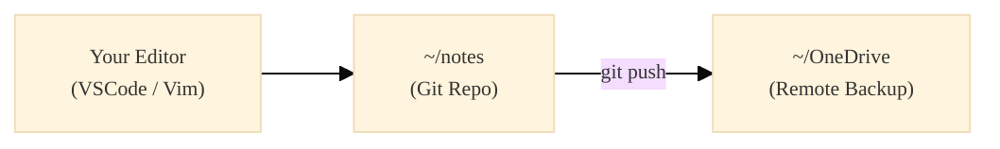
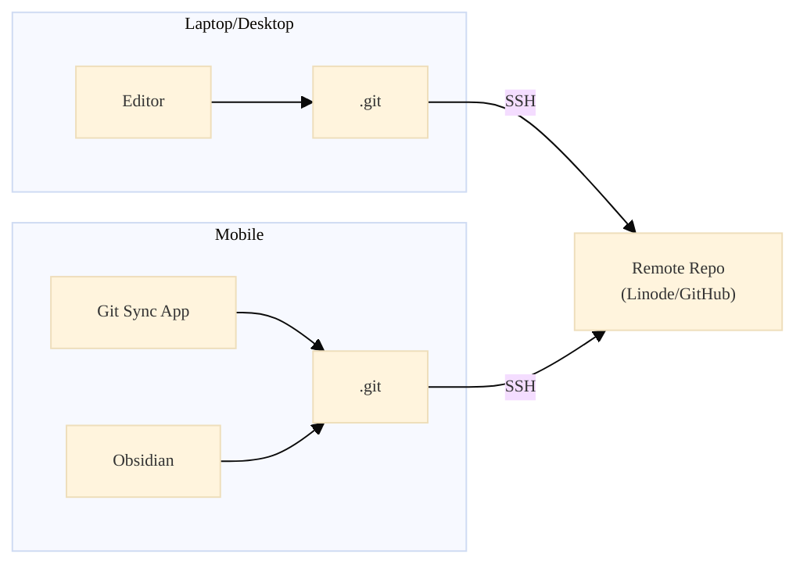

> tl;dr. My pitch is,
> you anyway write your notes in Markdown `.md` files,
> why not index and search them with [zk-org](https://github.com/zk-org/zk)?
> And yes, the setup is editor agnostic.

<!-- ## Context switching is productivity killer -->
## Context switching is your problem

Going from meeting to meeting, problem to problem, digitial fire to digital fire made me forget things.
I need some outlet to focus my thoughts, tasks and lessons.
I need to search them and find "that one meeting I had last month".

Every time you jump between tasks, projects, or random ideas, your brain has to reload whatever you were doing before—and it never loads as fast as you want.
You end up feeling busy but not actually getting anywhere.
Half the stress comes from trying to remember where you left off.
Without a simple way to dump your thoughts and pick them up later, context switching just turns your day into a messy pile of half-finished tabs—both in your browser and in your brain.

If you feel ADHD-like at work, maybe you just need better notes?

Privately I used;

- Trello for recipes and daily todo
- Notion for project notes
- Sending myself an email with a link I need to check out later

At work I used

- Outlook To Do

They didn't feel good.
The same way I didn't start using [Obsidian](https://obsidian.md/),
I don't want to have a extra application open jus to manage my notes.
Also, I don't need a graph 

So I started using `vim todo/$(date +%Y-%m-%d).md` at work for a place to write meeting notes and todos.

<!-- (Notion, Trello, Obsidian, Google Docs — great tools used the wrong way) -->
<!-- (Why context switching is killing your productivity, focus, and memory) -->


Why not use Obsidian?
I don't need a graph showing my notes, I need a easy fuzzy-find setup that integrates to my editor.

- I have this one idea, but I don't want to ruin my current flow
- I am in bed/flight and I have this idea
- Search your recipies, on your phone, in the super market

> "We easily get distracted by open tasks, not finished tasks.
> Convince our brain that it will be taken care of, by write it down.
> Calms the brain." - Sönke Ahrens (How to Take Smart Notes)


## The solution you are looking for is `zk`

Obviously the solution is, take notes.
Having a quick way to write down thoughts/tasks tricks your mind that it will be done later and makes it easier to focus on current task.
Like when you write things down on sticky notes.

TODO Introduce zk


<!-- The Psychology: Why Writing Things Down Frees Your Brain -->
<!-- (From the podcast — externalizing tasks to calm your mental load) -->

TODO Explain zk

TODO Zettlekasten

TODO cognitive offloading

TODO Book mention

If you want to really go desconstrictionist, you can read "How to Take Smart Notes" by Sönke Ahrens,
but, I really don't recommend the book.
It is only for people who wants to ask the question "What IS a note?".

    By writing it down, we get it out of our head
    Don't let your brain get occupied by all the little stuff. 
    We cannot fix everything RIGHT NOW.
    Write so it is easy to pick up the task later 
    Still in the inbox. Check your daily inbox of tasks. Stay focused

externalizing tasks to calm your mental load

Actually, I get annoyed I didn't start earlier because I remember I worked on something else
years ago, but don't remember the details. Where is my notes??
I know I worked with this before!

TODO ZK is editor agnostic, and works great with VSCode

### I don't want to use vim!

Sorry to hear that, but, that is perfectly fine.
The approach is editor agnostic, as `zk` is used to index and search your notes,
it has nothing to do with the editor.


They setup works really great with VSCode as well.
Just configure `editor = "code -r"`.

## How I use it at `zk` work




daily todo
meeting notes
- open tasks

tags

used claude sonnet to clean my notes:
    - or summarize a transcript

sync to onedrive

links
work examples

confluence guides

snippets


## How I use `zk` privately

Scenarios that kept happening

- I'm in bed, I see a cool Instagram wood project and want to save it for later
- I'm in the supermarket and need my shopping list / recipes
- I'm doing taxes, and forgot what I did last year

So I needed a searchable note system, which is also accessible on my mobile.
In the end I set up a `git` repository at [Linode](https://www.linode.com/) which is then accessible via ssk-key pair.
This would work fine on a private GitHub project, but I didn't want my private notes to be used as AI training data.



- capture notes
- recipies:
    - I find recipies on my computer and make it into a shopping list
- project todos
- collect thoughts

daily todo

> I'm in bed, I have an idea/see something I should research


## Setup, installation and configuration

Following
[zk-org.github.io/zk](https://zk-org.github.io/zk/)
easy setup `zk`.
You can compile it by clone and `make`-ing it, with [go](https://go.dev).

    cd $HOME/opt/
    git clone https://github.com/zk-org/zk.git zk.git --depth 1
    cd zk.git
    make build
    ln -s $HOME/opt/zk.git/zk $HOME/bin/zk

or if you are on a Mac, you can;

    brew install zk

With the executable installed, create a note folder `~/notes/` and `git init`.
Inside the folder create a `.zk` for your configuration and templates.
For me the setup is

    .zk
    .zk/templates
    .zk/templates/todo.md
    .zk/templates/default.md
    .zk/templates/meeting.md
    .zk/config.toml
    .zk/.gitignore # ignore .sqlite


A template would look something like this

<details markdown="1">
<summary><b>default_template.md</b></summary>

```markdown
---
date: {{ format-date now 'long' }}
title: {{ title }}
tags: [Untitled]
---

# Untitled

- Untitled
```

</details>

Example 
config link

why untitled?


<details markdown="1">
<summary><b>config.toml</b></summary>

```toml
[note]
language = "en"
default-title = "Untitled"
filename = "{{format-date now '%Y-%m-%d'}}-{{id}}"
extension = "md"
template = "default.md"
id-charset = "alphanum"
id-length = 8
id-case = "lower"

[group]

[group.todo]
paths = ["todo"]

[group.today.note]
filename = "{{format-date now '%Y-%m-%d'}}"
extension = "md"
template = "daily.md"

[group.meeting]
paths = ["meetings"]

[group.meeting.note]
filename = "{{format-date now '%Y-%m-%d-%H%M'}}-{{id}}"
extension = "md"
template = "meeting.md"

[format.markdown]
hashtags = true

[tool]
editor = "vim -c \"silent! /Untitled\" -c 'call search(\"Untitled\")' "
pager = "less -FIRX"
fzf-preview = "bat -p --color always {-1}"
fzf-options = "--multi --tiebreak begin --exact --tabstop 4 --height 100% --no-hscroll --color hl:-1,hl+:-1 --preview-window wrap"

[alias]

# Create new note, from templates
n = 'zk new'
today = 'zk new --group todo --no-input "$ZK_NOTEBOOK_DIR/todo" --template todo.md'
meeting = 'zk new --group meeting'
m = 'zk meeting'

# Usage:
# - zk todo next friday
# - zk todo tomorrow
# - zk todo yesterday
todo = 'zk new --group today --no-input --date "$(date -d "$*" +%Y-%m-%d)" "$ZK_NOTEBOOK_DIR/todo" --template daily.md'

# Find and edit
last = "zk edit --limit 1 --sort modified- $argv"
recent = "zk edit --sort created- --created-after 'last 7 days' --interactive"
recent-month = "zk edit --sort created- --created-after 'last 30 days' --interactive"
ls = "zk edit --interactive --sort created"
t = "zk edit --interactive --tag $(zk tag --quiet | fzf | awk '{print $1}')"
ta = "zk edit --tag $(zk tag --quiet | fzf | awk '{print $1}')"

# Manage the notes
update = "cd $ZK_NOTEBOOK_DIR; git add -A; git commit -am 'updating'; git pull; git push; cd -"
clean = "zk-clean"
clean-dry = "zk-clean --dry-run"
sync = "zk update && zk index"

# Find all unresolved tasks within a zk tag
open-tasks = "cd $ZK_NOTEBOOK_DIR; zk list --tag $(zk tag --quiet | fzf | awk '{print $1}') --format {{path}} --quiet | xargs rg --no-heading --with-filename -F '[ ]'"

```

</details>

Note, if you want to use VSCode, you just need to set the configration to

    editor = "code -r"

Noteable the alias I've setup are

```toml
# Use GNU date to interpret releative dates for todo lists. For example
# - zk todo
# - zk todo tomorrow
# - zk todo yesterday
# - zk todo next friday
# - zk todo 3 months 1 day
# - zk todo 25 dec
todo = 'zk new --group today --no-input --date "$(date -d "$*" +%Y-%m-%d)" "$ZK_NOTEBOOK_DIR/todo" --template daily.md'

# Use fzf to interactively choose the tag I then want to search in
t = "zk edit --interactive --tag $(zk tag --quiet | fzf | awk '{print $1}')"

# Use git to pull and push, then re-index the zk database
update = "cd $ZK_NOTEBOOK_DIR; git add -A; git commit -am 'updating'; git pull; git push"
sync = "zk update && zk index"

# Find all unresolved Markdown tasks within a zk tag, with fzf and ripgrep
open-tasks = "cd $ZK_NOTEBOOK_DIR; zk list --tag $(zk tag --quiet | fzf | awk '{print $1}') --format {{path}} --quiet | xargs rg --no-heading --with-filename -F '[ ]'"
```

## Setup Compatiable Mobile

Compatible

- daily note -> todo format
- automat open
- search

> We might solve a crucial problem while doing the groceries.


## Conclusion

Just do it.
Setup `zk` for a folder of Markdown files, and use your favourite code editor to continue to write notes.

## Thanks

To Kristoffer for proofreading again.

## References

- [github.com/charnley/dotfiles](https://github.com/charnley/dotfiles) - my dotfile configuration
- [github.com/zk-org/zk.git](https://github.com/zk-org/zk.git) - the main CLI tool to search and index your notes

