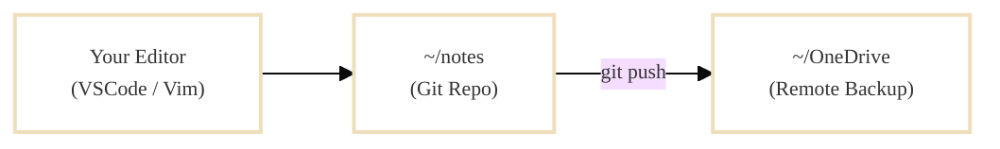
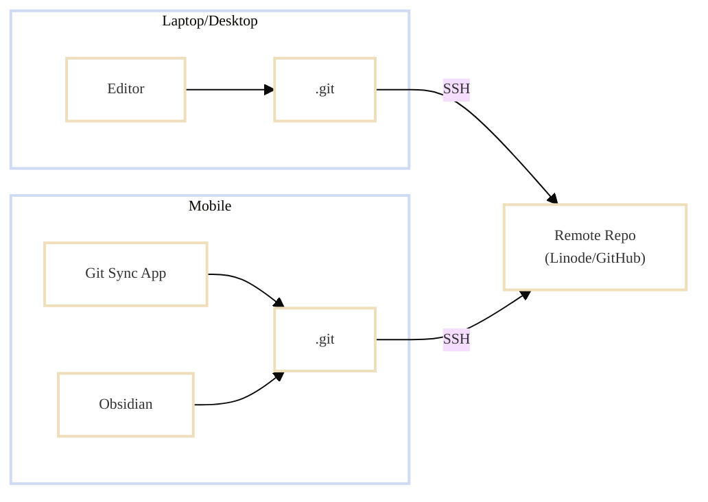

tl;dr. My pitch is,
you anyway write your notes in Markdown-like text files;
why not index and search them with [zk-org](https://github.com/zk-org/zk)?
And yes, although I use Neovim, the setup is editor agnostic.
I promise this is not overkill!


<!-- ## Context switching is productivity killer -->
## Context switching is your problem

I constantly jump between meetings, problems, and digital fires, all while trying to maintain a strategic overview.
Privately, I juggle too many open projects as well.
Half my stress isn’t the work itself—it’s trying to remember where I left off.
My brain never reloads context fast enough.

If you feel a little ADHD-ish at work, it might not be you. You might just need a better notes-system.

I tried the usual tools:

- [Trello](https://trello.com) for recipes and daily todos
- [Notion](https://www.notion.so/) for project notes
- Emailing myself links as a "read later" system
- and using [Outlook "To Do"](https://to-do.office.com/tasks/) at work

None of it felt natural.
I don’t want another app, dashboards, backlinks, or
[graphs of my notes](https://help.obsidian.md/plugins/graph).
I want something fast, searchable, and editable in the text/code editor I already use.
That rules out tools like
[Obsidian](https://obsidian.md/).

What worked best was keeping everything in a single file per day—meetings, tasks, and stray thoughts.
`vim ~/todo/$(date +%Y-%m-%d).md`.
But when I switch context $$5\cdot10^6$$ times a day, even a simple daily log can turn into a mess.

From Sönke Ahrens in his book "How to Take Smart Notes" we can use [Cognitive offloading](https://en.wikipedia.org/wiki/Cognitive_load) to focus;

> Writing things down lets your brain focus on other tasks, **but only if you can easily find them again**.
> If notes are hard to retrieve, your brain won’t trust the system.

It's an interesting book, if you enjoy deconstructing the concept of a note and the cult-like enthusiasm for [Zettelkasten](https://en.wikipedia.org/wiki/Zettelkasten). I didn't.
But the point is clear: **I need to find a way to easily navigate my notes, without an external program**.

## The solution you are looking for is "zk"

Obviously the solution is, take notes.
Practically, this year I found **[zk](https://github.com/zk-org/zk.git)**,
and it was exactly what I was looking for.
**A terminal tool for indexing and searching Markdown files**.
Having a quick way to write down thoughts/tasks tricks your mind that it will be done later and makes it easier to focus on current task.


Like Obsidian, it is based around [Zettlekasten](https://en.wikipedia.org/wiki/Zettelkasten) concept,
a note-taking system/philosophy.
Again, the book above will go deep into the cult... sorry, I mean the details of the system.


In practise my Markdown notes looks like the follow structure, with date, title, tags, content and open tasks.

```markdown
---
date: December 05, 2025
title: Title of my note
tags: [tag1,tag2,tag3]
---

Kristoffer, Kim, Jimmy

- This is an example note.
- Maybe a meeting? Maybe a project?

- [ ] This is an example of a open task
- [x] This is an example of a close task
```

All the content is the indexed by `zk` and put in a `.sqlite` database in your note folder.
I include the name of the people in the meetings so I can easily search for it. 
Unlike Obsidian, `zk` is a much more light-weight and practical tool.
The only role is to index and search, then the result can be opened in your code editor.

Because it is a CLI tool, you can very easily customize the workflow with standard GNU tools,
and [terminal fuzzy-finding](https://github.com/junegunn/fzf) and [ripgrep](https://github.com/BurntSushi/ripgrep).
I really enjoy building custom commands that work exactly for me.
For example using GNU `date` you can use releative dates to access todo list for other days.

```toml
todo = 'zk new --group todo --no-input --date "$(date -d "$*" +%Y-%m-%d)" "$ZK_NOTEBOOK_DIR/todo" --template todo.md'
```

```bash
zk todo # open today's todo-list
zk todo tomorrow # open tomorrows todo-list
zk todo next monday
zk todo yesterday
```

For the last months working with `zk` I got annoyed I didn't start earlier because I remember I worked on something else
years ago, but don't remember the details. Where is my notes??
I know I worked with this before!

### I don't want to use vim!

Sorry to hear that, have you heard of [Neovim](https://github.com/neovim/neovim)? But, that is perfectly fine.
The approach is editor agnostic, as `zk` is used to index and search your notes,
it has nothing to do with the editor.
`zk` has really good seperation of concern in this regard.


If you are stuck on Microsoft and using VSCode, `zk` works really well with the editor terminal.
Just configure `editor = "code -r"` as part of the `zk` `config.toml`, and when you select/create new notes they will be open straight in VSCode.

## How I use `zk` at work

My notes is a folder full of Markdown files that I could be storing on OneDrive,
but I still like to have the history tracking of my notes, so in the end I use Git to manage my notes, and using OneDrive as a "remote" for backup.



In practise, I 

- Set my daily todo list to try to keep me focused
- Use meeting template, keeping track who was there and what actionable follow is needed
- Tag everything so I can quickly find a meeting / topic
- Search for open Markdown tasks `[ ]`, per tag to know if items are forgotten
- I keep lists of different internal wiki/forum links with my notes, as it is easier to find than a linear bookmark system
- I keep snippets of how to use our internal infrastructure

Since I am at work I don't mind the licensed AI models are reading my stuff,
I can copy-paste the transcript from meetings and use Sonnet to re-write it into Markdown and find follow-ups.
Obviously I use [sst OpenCode](https://github.com/sst/opencode) for my agentic AI work, which works well with our company licensed models,
and fit my `tmux`-based work flow.

## How I use `zk` privately

Scenarios that kept happening

- I'm in bed, I see a cool Instagram wood project and want to save it for later
- I'm in the supermarket and need my shopping list / recipes
- I'm doing taxes, and forgot what I did last year

So I needed a searchable note system, which is also accessible on my mobile.
In the end I set up a `git` repository at [Linode](https://www.linode.com/) which is then accessible via ssk-key pair.
This would work fine on a private GitHub project, but I didn't want my private notes to be used as AI training data.



Having all my notes in one setup, it makes it really easy to navigate my projects/private projects.
I'm in the supermarket and I need the grocery list for Lasagne? Pow, just load it on my phone.

Overall I really enjoy the connectivity between having searchable indexed notes between my desktop computer, laptop and phone.
It feels like I can continue whatever I am doing, whenever.

## Setup, installation and configuration

Sold on the idea?
Following
[zk-org.github.io/zk](https://zk-org.github.io/zk/)
we can easily set up `zk`.
You can compile it by clone and `make`-ing it, with [go](https://go.dev).

    cd $HOME/opt/
    git clone https://github.com/zk-org/zk.git zk.git --depth 1
    cd zk.git
    make build
    ln -s $HOME/opt/zk.git/zk $HOME/bin/zk

or if you are on a Mac, you can simply;

    brew install zk

With the executable installed, create a note folder `~/notes/` and `git init`.
Inside the folder create a `.zk` for your configuration and templates.
For me the setup is

    .zk
    .zk/templates
    .zk/templates/todo.md
    .zk/templates/default.md
    .zk/templates/meeting.md
    .zk/config.toml
    .zk/.gitignore # ignore .sqlite


A template would look something like this

<details markdown="1">
<summary><b>default_template.md</b></summary>

    ---
    date: {{ format-date now 'long' }}
    title: {{ title }}
    tags: [Untitled]
    ---

    # Untitled

    - Untitled

</details>

Why have "Untitled" in my template?
Because I sat op my editor [Neovim](https://github.com/neovim/neovim) to jump through "Untitled"
so I can quickly <kbd>n</kbd><kbd>c</kbd><kbd>w</kbd> (next match, change word).

My configuration for filename format, and other settings looks like;

<details markdown="1">
<summary><b>config.toml</b></summary>

    [note]
    language = "en"
    default-title = "Untitled"
    filename = "{{format-date now '%Y-%m-%d'}}-{{id}}"
    extension = "md"
    template = "default.md"
    id-charset = "alphanum"
    id-length = 8
    id-case = "lower"

    [group]

    [group.todo]
    paths = ["todo"]

    [group.todo.note]
    filename = "{{format-date now '%Y-%m-%d'}}"
    extension = "md"
    template = "todo.md"

    [group.meeting]
    paths = ["meetings"]

    [group.meeting.note]
    filename = "{{format-date now '%Y-%m-%d-%H%M'}}-{{id}}"
    extension = "md"
    template = "meeting.md"

    [format.markdown]
    hashtags = true

    [tool]
    editor = "vim -c \"silent! /Untitled\" -c 'call search(\"Untitled\")' "
    pager = "less -FIRX"
    fzf-preview = "bat -p --color always {-1}"
    fzf-options = "--multi --tiebreak begin --exact --tabstop 4 --height 100% --no-hscroll --color hl:-1,hl+:-1 --preview-window wrap"

    [alias]

# Create new note, from templates
    n = 'zk new'
    today = 'zk new --group todo --no-input "$ZK_NOTEBOOK_DIR/todo" --template todo.md'
    meeting = 'zk new --group meeting'
    m = 'zk meeting'

# Usage:
# - zk todo next friday
# - zk todo tomorrow
# - zk todo yesterday
    todo = 'zk new --group todo --no-input --date "$(date -d "$*" +%Y-%m-%d)" "$ZK_NOTEBOOK_DIR/todo" --template todo.md'

# Find and edit
    last = "zk edit --limit 1 --sort modified- $argv"
    recent = "zk edit --sort created- --created-after 'last 7 days' --interactive"
    recent-month = "zk edit --sort created- --created-after 'last 30 days' --interactive"
    ls = "zk edit --interactive --sort created"
    t = "zk edit --interactive --tag $(zk tag --quiet | fzf | awk '{print $1}')"
    ta = "zk edit --tag $(zk tag --quiet | fzf | awk '{print $1}')"

# Manage the notes
    update = "cd $ZK_NOTEBOOK_DIR; git add -A; git commit -am 'updating'; git pull; git push; cd -"
    clean = "zk-clean"
    clean-dry = "zk-clean --dry-run"
    sync = "zk update && zk index"

# Find all unresolved tasks within a zk tag
    open-tasks = "cd $ZK_NOTEBOOK_DIR; zk list --tag $(zk tag --quiet | fzf | awk '{print $1}') --format {{path}} --quiet | xargs rg --no-heading --with-filename -F '[ ]'"

</details>

Where noteable the interesting alias I've setup are

    # Use GNU date to interpret releative dates for todo lists. For example
    # - zk todo
    # - zk todo tomorrow
    # - zk todo yesterday
    # - zk todo next friday
    # - zk todo 3 months 1 day
    # - zk todo 25 dec
    todo = 'zk new --group todo --no-input --date "$(date -d "$*" +%Y-%m-%d)" "$ZK_NOTEBOOK_DIR/todo" --template todo.md'
    
    # Use fzf to interactively choose the tag I then want to search in
    t = "zk edit --interactive --tag $(zk tag --quiet | fzf | awk '{print $1}')"
    
    # Use git to pull and push, then re-index the zk database
    update = "cd $ZK_NOTEBOOK_DIR; git add -A; git commit -am 'updating'; git pull; git push"
    sync = "zk update && zk index"
    
    # Find all unresolved Markdown tasks within a zk tag, with fzf and ripgrep
    open-tasks = "cd $ZK_NOTEBOOK_DIR; zk list --tag $(zk tag --quiet | fzf | awk '{print $1}') --format {{path}} --quiet | xargs rg --no-heading --with-filename -F '[ ]'"

## Mobile Compatiable Setup

On your mobile install

- [obsidian.md/mobile](https://obsidian.md/mobile)
- [gitsync.viscouspotenti.al](https://gitsync.viscouspotenti.al/)

The setup is then, use GitSync to clone, pull, push the note git repository.
Then use Obsidian to search and edit Markdown.
GitSync can also be set up to auto-sync on Obsidian open/close.
Personally I found a manual usage worked fine.

For Obsidian Mobile configuration, ensure that "daily" format is the same as with `zk`, for both filename and directory.

    Settings -> Daily notes
    - Change "Date format"
    - Change "New file location"
    - Check "Open daily note on startup", to auto open today's note

Tag and search will work out of the box.
The interface is somewhat clunky, but good enough.

## Conclusion

I am going to assume you have either Notepad or VSCode open to write notes in a very Markdown-like syntax anyway.
So just do it.
Setup `zk` for a folder of Markdown files, and use your favorite code editor to continue to write notes.
And then actually find them again.

Happy note-ing.

Thanks to Kristoffer for proofreading again.

## References

- [github.com/charnley/dotfiles](https://github.com/charnley/dotfiles) - my dotfile configuration
- [github.com/zk-org/zk.git](https://github.com/zk-org/zk.git) - the main CLI tool to search and index your notes
- [Getting started with zk](https://zk-org.github.io/zk/tips/getting-started.html)
- [Obsidian](https://obsidian.md/) - Overkill Zettlekasten-based note taking application
- [ViscousPot/GitSync](https://github.com/ViscousPot/GitSync) - Sync git repos on your phone
- [en.wikipedia.org/wiki/Cognitive_load](https://en.wikipedia.org/wiki/Cognitive_load) - Cognitive offloading
- Sönke Ahren "How to Take Smart Notes" - this is not a recommendation, just a reference
