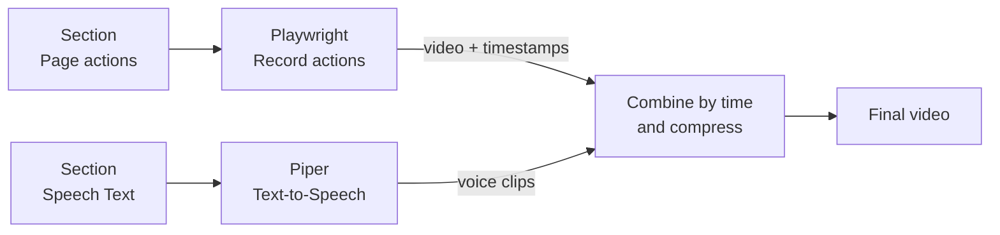

<!--     Tutorials as Code: End-to-End Video Automation with Playwright -->
<!--     What Terraform Did for Infrastructure, Playwright Can Do for Tutorials -->

<!-- - Relevant for internal tools, where user interface changes -->
<!-- - What Puppet/Ansible/Terraform do for infrastructure, I want Playwright to do for Tutorials -->
<!-- - End-to-End Testing, but for Tutorials -->
<!-- - Treat Tutorials Like Infrastructure -->
<!-- - Stop Recording Tutorials. Start Testing Them. -->

<!-- title: "Video Tutorial and Documentation Automation (Tutorials as code)" -->
tldr: Treat tutorial as code.
Using `playwright` end-to-end testing, and `Piper` text-to-speech,
we can use create automated tutorials, every time the UI changes.

<video style="max-width:100%" controls playsinline src="https://user-images.githubusercontent.com/126239/151127893-5c98ba8d-c431-4a25-bb1f-e0b33645a2b6.mp4"></video>

# We want to help new users use internal software


Most companies/teams don’t have the resources to produce video tutorials.
There’s no video crew, no narrator, no editor, and no time to re-record when the UI changes.
So tutorials get recorded once, shipped late, and quietly get deprecated with application changes.

I work in a small team, we definetly cannot afford to make video tutorials,
and often rely on our champion users to generate the content.

This isn’t a process failure, it’s an economics problem.
If tutorials require humans to record and edit them, they won’t scale.

The only tutorials that survive are the ones that are cheap to regenerate.
That means treating them like software artifacts, not media files.

Most teams don’t have a video crew.

They don’t have a script writer, a narrator, a screen recorder, a video editor, or time blocked out to re-record tutorials every time the UI changes.

So tutorials become a one-off effort:
recorded once, slightly outdated immediately, and quietly abandoned the moment something breaks.

This isn’t a discipline problem.
It’s a resourcing problem.

The only way tutorials survive in real organizations is if they’re cheap to produce, cheap to update, and boring to maintain.

This post is about treating tutorials like end-to-end tests:
scripted, reproducible, and automated — using Playwright and text-to-speech.


We already treat infrastructure as code.
We treat deployments as code.
We treat tests as code.
But tutorials?
Those are still recorded by hand, narrated live, and silently rot the moment the UI changes.

So videos get recorded once, shipped late, and never updated again.

If tutorials require human recording, they will not scale.

I got the idea from a champion user who recorded his actions
then he used microsoft to do text-to-speech.

But wait, I can automate the actions?

# Treating Video Tutorials Like Infrastructure (tutorials-as-code)

TODO Sell playwright
TODO Sell piper tts



Think Infrastructure as Code, but for tutorials.

Most teams don’t make video tutorials.

Not because they don’t want to — but because they don’t have:
a narrator, an editor, a studio, or the budget to re-record everything after every release.

This post is about a different approach:
tutorials as code — generated the same way we already run end-to-end tests, using Playwright and text-to-speech.

Video tutorials are treated as media assets, but they need to behave like software artifacts.

Most organizations cannot afford:

Manual re-recording

Narration updates

Video editing cycles

So the only viable solution is automation.

> If a tutorial can’t be regenerated from source, it’s already outdated.

TODO Show piper example

This post is about treating tutorials like end-to-end tests: scripted, reproducible, and boring in the best possible way.
Using Playwright, text-to-speech, and a browser, we can generate video tutorials automatically — the same way we already validate our apps.

Because it is playwright, the tutorial will also fail to compile if the application change too much from the last compilation.
Which forces the maintainer to look into it.

Tutorials Are Just End-to-End Tests with a Voice

* Docs, onboarding, demos, internal training

* Playwright already:

  * Drives the browser
  * Waits for state
  * Replays flows deterministically

* A tutorial is:

  * A scripted user journey
  * With narration
  * And a visual output

Draw the explicit parallel:

* Terraform:

  * Declarative
  * Versioned
  * Reproducible

* Tutorial scripts:

  * Declarative flows
  * Versioned narration
  * Reproducible videos

# Example: A svelte application with corresponding video tutorial


github link
this is not a package, just a proof-of-concept

TODO Explain svelte and why

TODO Show screencast of recording usage of the website
TODO Show piper example
TODO Show playwright video
TODO Show playwright highlight css
TODO Show playwright page action example

```bash
python -m playwright codegen https://molcalc.org
```

* A single Playwright script
* A text file for narration
* A generated MP4

Show:

* Script → run → video
* No screen recording
* No manual editing

Why This Scales (And Manual Recording Doesn’t)

*(Practical payoff section)*

Cover benefits:

* CI-generated tutorials
* UI changes → re-run script
* Tutorials tied to releases
* One source of truth

Optional callout:

# Conclusion


*(Strong, opinionated wrap-up)*

* Stop treating tutorials as recordings
* Treat them as **artifacts**
* If it matters, automate it
* If it can’t be regenerated, it’s already broken

## Appendix: How to setup

Go see github link


