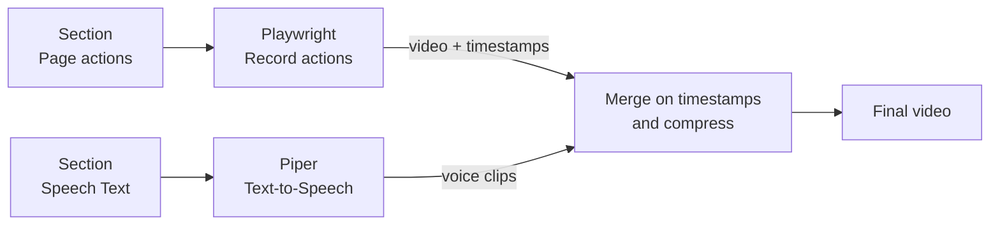

tldr:
tutorials-as-code.
Using `playwright` end-to-end browser testing, and `Piper` text-to-speech,
we can create automated tutorials, every time the user-interface/application changes.
Example code: [github.com/charnley/example-training-as-code](https://github.com/charnley/example-training-as-code).

> **Play with sound**
> <video style="max-width:100%" controls playsinline src="{{site.baseurl}}/assets/images/about_tutorial/localhost_recording_compressed.mp4"></video>

# Recording Tutorials are Expensive

I work in a small team.
Like most small teams, documentation is always on the backlog.
Not the highest priority with constant digital fires, so documentation and especially videos.

We don’t have the budget for a video crew, voice actors or time to update every time UI updates, so tutorials are out of the question.
Someone has to plan, record, narrate, edit, and redo them when flows change.
The result I usually see are usually one-off recordings that are always obsolete.

> "Oh no, don't press that button. Did you watch the tutorial? You shouldn't, sorry, that is outdated now" - Manual Tutorial User

The only tutorials that survive are cheap to produce and cheap to update.
That means treating them like software artifacts, not media files.
Infrastructure is code. Deployments are code. Tests are code. Tutorials should also be.

What really clicked for me was when a champion of our users recorded himself using an application,
then added speech using Microsoft text-to-speech (Very cool Thierry).
My first thought was: "I can just automate the recording."

What we test and what we want to document is usually the same thing.
User flows, edge cases, authentication—Playwright already automates them.
Add text-to-speech, and suddenly we can turn scripts into reproducible, maintainable tutorial videos without a crew.

> Treating Video Tutorials Like Infrastructure. Tutorial-as-code.

The two components we need are simply 
[playwright](https://playwright.dev/) to record actions and 
[Piper](https://github.com/OHF-Voice/piper1-gpl)
to record voice overs.

# Emulating the browser, i.e. Playwright

If you don't know [playwright](https://playwright.dev/),
it is a browser automation and end-to-end testing tool for both JavaScript and Python.
It lets you script real browser interactions — clicks, form fills, navigation — and run them headlessly or with a visible browser window.

For our purposes, we set up a script that pretends to be a user running through a full workflow.
By default Playwright fills inputs instantaneously, so to make it feel human-like we add pauses and realistic typing speed.

A great starting point is the `codegen` command, which records your manual interactions and outputs the equivalent Playwright code:

```bash
python -m playwright codegen https://localhost:5173/
```

> 

You interact with the browser and your actions appear as generated code in a side panel.
It is especially helpful if you are new to Playwright's API.

```python
from playwright.sync_api import sync_playwright
# Init the browser, with defined outpout video path and browser dimensions.
playwright = sync_playwright().start()
browser = playwright.chromium.launch(headless=True)
viewpoint = {"width": browser_width, "height": browser_height}
context = browser.new_context(record_video_dir=work_dir, viewport=viewpoint, record_video_size=viewpoint)

# Get the page object to apply actions on
page = context.new_page()

# Do actions on `page`
...

# Get the video path of the actions
path  = page.video.path()

# Stop and close playwright, browser and context
...
```

Make it slower and human like

I add lots of `page.wait_for_timeout` for the narration and actions to keep up, and space it out more.

I added some functions to make it feel more human-like

- `slow_writing` adding random delays to the typing `random.uniform(0.2, 0.5)` and random typing errors `random.choice("abcdef")`.
- `highlight` adds a css class to an element to highlight it with a blue color `element.evaluate(f"el => el.classList.add('highlight')")`.
- `blur` sometimes I need to remove focus from element, which is pretty easy with `page.mouse.click(0, 0)`.

> **Note:** Playwright works way better in headless mode for recording. If not you get a weird white border.

> **Note:** Because it can run headless, that also means it works great in a docker-based run.

# Emulating voice-over, i.e. Piper TTS

> **Edit:** I chose Piper TTS at point of writing, but [Kitten TTS](https://github.com/KittenML/KittenTTS) looks very promising. Thanks Patrick.

The browser emulation doesn't contain any sound, so we need to generate a overlay narration that goes with each action.
First I looked at `festival` which is `apt`-installable and pretty universal.

```bash
festival --tts --voice awb script.txt
```

However, this is more robotic than Microsoft Sam. Very distracting.
Instead I found **Piper TTS**, which seems to be a project that has moved owner quite a few times, but has now landed under the ownership of [Open Home Foundation](https://www.openhomefoundation.org).

- [newsletter.openhomefoundation.org/piper-is-our-new-voice-for-the-open-home](https://newsletter.openhomefoundation.org/piper-is-our-new-voice-for-the-open-home/).

Which is great, as I am already quite a big fan of Home Assistant and the foundation behind it.
Piper TTS is a fast, local and open-source model for TTS with a big variety of voices and languages. Even Danish. See [Piper Samples](https://rhasspy.github.io/piper-samples/).

At times it still sounds a bit robotic, but not really distractingly so.
I have found the English voice "Amy" to be a good choice — natural enough that listeners focus on the content rather than the voice.
There is a slight issue with un-natural short breaks between sentences, but that could possible be configured.
I fixed some pauses by splitting out the conversation into multiple sound files.

Example:

```text
Hi. This is Amy speaking, presenting MolCalc.
Let's try to make a quantum calculation. Press the search, type in "Pro-pa-nol", then enter.
The molecule is loaded from Cactus.
Then we press "Calculate", and whoop, we have properties.
```

```bash
python -m piper -m en_US-amy-medium -i ./how_to_molcalc.txt -f ./how_to_molcalc.mp3
```

> <audio style="max-width:100%" controls playsinline src="{{site.baseurl}}/assets/images/about_tutorial/amy_hello_molcalc.mp3"></audio>

Does it sound robotic? Slightly, yes — but still impressive for a fully local, offline model.
For extra point in your tutorial, you can even [train your own voice](https://github.com/OHF-Voice/piper1-gpl/blob/main/docs/TRAINING.md).

# Together

The tutorials is written as a list of sections/scenes.
Each section is a pair: what the browser does, and what is narrated.


```mermaid
flowchart LR

    actions[Section<br /> Page actions] --> Playwright[Playwright<br/>Record actions]
    text[Section <br/> Speech Text] --> TTS[Piper<br/>Text-to-Speech]

    Playwright -->|video + timestamps| Combine[Merge on timestamps<br />and compress]
    TTS -->|voice clips| Combine

    Combine --> Final[Final video]

```

It is a question of timing.
Browser actions often finish faster than the narration.
If you don't account for that, the next section starts while Amy is still talking.
This is fixed to just have the browser sleep while Amy is talking.

Practically in my example I use a decorator to link them together into two lists.

```python
@add_section("Narration Text")
def section_name(page: Page):
    page.do_action()
    ...
```

Then stitch it together using `moviepy`.

# Conclusion / Closing thoughts

> Stop Recording Tutorials. Start Testing Them. Start coding them.

What if the app changes and the tutorial script stops working? Good.
That means your application changed and the tutorial needs updating — which is exactly the point.
Because Playwright is a testing framework, a broken tutorial script is just a failing test.
It forces the maintainer to revisit it, which is far better than a silently outdated video.

- Stop treating tutorials as recordings
- Treat them as **artifacts**
- If it matters, automate it
- If it can't be regenerated, it's already broken

A few practical tips from experience:

- **Keep videos slow.** Viewers can always watch at 1.5x speed, but can't rewind what they missed. Err on the side of too slow.
- **Use AI to help with timing.** LLMs are surprisingly good at splitting `codegen` output into human-paced steps with sensible wait times.
- **Prefer micro-tutorials.** Short, focused walkthroughs of a single flow teach better than long all-in-one recordings.

## Appendix: How to setup

Go see the example code at [github.com/charnley/example-training-as-code](https://github.com/charnley/example-training-as-code).

The example uses a small [SvelteKit](https://svelte.dev/) app with [TailwindCSS](https://tailwindcss.com/) and [shadcn-svelte](https://shadcn-svelte.com) components.
Which I very much prefer over React.
The stack doesn't matter much.
Any web application Playwright can drive will work.
Svelte just happens to be fast to spin up for a demo.

## References

- [github.com/charnley/example-training-as-code](https://github.com/charnley/example-training-as-code)
- [playwright.dev](https://playwright.dev/)
- [github.com/OHF-Voice/piper1-gpl](https://github.com/OHF-Voice/piper1-gpl)
- [rhasspy.github.io/piper-samples](https://rhasspy.github.io/piper-samples/)
- [newsletter.openhomefoundation.org — Piper is our new voice for the open home](https://newsletter.openhomefoundation.org/piper-is-our-new-voice-for-the-open-home/)
- [github.com/KittenML/KittenTTS](https://github.com/KittenML/KittenTTS)
- [svelte.dev](https://svelte.dev/)
- [tailwindcss.com](https://tailwindcss.com/)
- [shadcn-svelte.com](https://shadcn-svelte.com)

