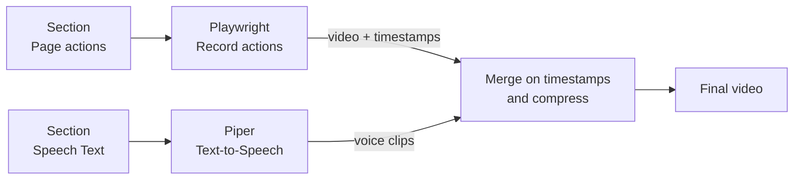

<!--
TODO
    - [ ] Re-do the codegen screenshot
    - [ ] Re-do amy without molcalc mention
-->

<!-- Tutorials as Code: End-to-End Video Automation with Playwright -->
<!-- What Terraform Did for Infrastructure, Playwright Can Do for Tutorials -->

<!-- Relevant for internal tools, where user interface changes -->
<!-- What Puppet/Ansible/Terraform do for infrastructure, I want Playwright to do for Tutorials -->
<!-- End-to-End Testing, but for Tutorials -->
<!-- Treat Tutorials Like Infrastructure -->
<!-- Stop Recording Tutorials. Start Testing Them. -->

<!-- title: "Video Tutorial and Documentation Automation (Tutorials as code)" -->

tldr:
tutorials-as-code.
Using `playwright` end-to-end browser testing, and `Piper` text-to-speech,
we can create automated tutorials, every time the user-interface/application changes.
Example code: [github.com/charnley/example-training-as-code](github.com/charnley/example-training-as-code).

> **Play with sound**
> <video style="max-width:100%" controls playsinline src="{{site.baseurl}}/assets/images/about_tutorial/localhost_recording_compressed.mp4"></video>

# Recording Tutorials are Expensive

I work in a small team.
Like most small teams, documentation are always on the backlog.
Not the highest priority with constant digital fires, so documentation and especially videos.

We don’t have the budget for a video crew, voice actors or time to update every time UI updates, so tutorials are out of the question.
Someone has to plan, record, narrate, edit, and redo them when flows change.
The result I usually see are usually one-off recordings that are always obsolete.

> "Oh no, don't press that button. Did you watch the tutorial? You shouldn't, sorry, that is outdated now" - Manual Tutorial User

The only tutorials that survive are cheap to produce and cheap to update.
That means treating them like software artifacts, not media files.

> Infrastructure is code. Deployments are code. Tests are code. Tutorials should also be.

What really clicked for me was when a champion of our users recorded himself using an application,
then adding speech using Microsoft text-to-speech (Very cool Thierry).
My first thought was "but, I can just automate the recording?"

We treat infrastructure as code, deployments as code, so why not also tutorials?

Because the only way tutorials/trainings in a real organisation survives is if they are cheap to produce, cheap to update.
Maintaining training is boring and time intensive.
Do more with less, as I've heard people say.

<!-- Most companies/teams don’t have the resources to produce video tutorials. -->
<!-- There’s no video crew, no narrator, no editor, and no time to re-record when the UI changes. -->
<!-- So tutorials get recorded once, shipped late, and quietly get deprecated with application changes. -->

<!-- I work in a small team, we definetly cannot afford to make video tutorials, -->
<!-- and often rely on our champion users to generate the content. -->

<!-- This isn’t a process failure, it’s an economics problem. -->
<!-- If tutorials require humans to record and edit them, they won’t scale. -->

<!-- The only tutorials that survive are the ones that are cheap to regenerate. -->
<!-- That means treating them like software artifacts, not media files. -->

<!-- Most teams don’t have a video crew. -->

<!-- They don’t have a script writer, a narrator, a screen recorder, a video editor, or time blocked out to re-record tutorials every time the UI changes. -->

<!-- So tutorials become a one-off effort: -->
<!-- recorded once, slightly outdated immediately, and quietly abandoned the moment something breaks. -->

<!-- This isn’t a discipline problem. -->
<!-- It’s a resourcing problem. -->

<!-- The only way tutorials survive in real organizations is if they’re cheap to produce, cheap to update, and boring to maintain. -->

<!-- This post is about treating tutorials like end-to-end tests: -->
<!-- scripted, reproducible, and automated — using Playwright and text-to-speech. -->


<!-- We already treat infrastructure as code. -->
<!-- We treat deployments as code. -->
<!-- We treat tests as code. -->
<!-- But tutorials? -->
<!-- Those are still recorded by hand, narrated live, and silently rot the moment the UI changes. -->

<!-- So videos get recorded once, shipped late, and never updated again. -->

<!-- If tutorials require human recording, they will not scale. -->

<!-- Small teams doesn't always write the best test suite -->
<!-- unit tests is possible -->
<!-- but if user actions are required and especially user auth -->
<!-- this can be tricky to program, hence playwright -->

<!-- Since we anyway will want to test -->
<!-- what we want to test and what we want to document is usually the same thing -->
<!-- might as well do a multi-kill here -->
<!-- or as managers would say, do more with less -->

<!-- I got the idea from a champion user who recorded his actions -->
<!-- then he used microsoft to do text-to-speech. -->

<!-- But wait, I can automate the actions? -->

What we test and what we want to document is usually the same thing.
User flows, edge cases, authentication—Playwright already automates them.
Add text-to-speech, and suddenly we can turn scripts into reproducible, maintainable tutorial videos without a crew.

> Treating Video Tutorials Like Infrastructure

The two components we need are simply 
[playwright](https://playwright.dev/) to record actions and 
[Piper](https://github.com/OHF-Voice/piper1-gpl)
to record voice overs.

# Emulating the browser, e.i. Playwright

If you don't know [playwright](https://playwright),
it is a automation / testing tool for both JavaScript and Python
used for 

For this example we can setup a end-to-end test where we pretend we are a user
and run a full workflow, testing.

by default playwright fill instantaneously input
To make it human-like we just add pauses and human-like typing speed

to create the action movie script 

```bash
python -m playwright codegen https://localhost:5173/
```

> 

to help us coordinate it
basically you press buttons and your actions appear in the action box
quite helpful, espcially if you are new to playwright

> **Note:** Playwright works way better in headless mode for recording. If not you get a weird white border.

> **Note:** Because it can run headless, that also means it works great in a docker-based run.

```python
from playwright.sync_api import sync_playwright
# Init the browser, with defined outpout video path and browser dimensions.
playwright = sync_playwright().start()
browser = playwright.chromium.launch(headless=True)
viewpoint = {"width": browser_width, "height": browser_height}
context = browser.new_context(record_video_dir=work_dir, viewport=viewpoint, record_video_size=viewpoint)

# Get the page object to apply actions on
page = context.new_page()

# Do actions on `page`
...

# Get the video path of the actions
path  = page.video.path()

# Stop and close playwright, browser and context
...
```

## Make it slower and human like

I add lots of `page.wait_for_timeout` for the narration and actions to keep up, and space it out more.

I added some functions to make it feel more human-like

- `slow_writing` adding random delays to the typing `random.uniform(0.2, 0.5)` and random typing errors `random.choice("abcdef")`.
- `highlight` adds a css class to an element to highlight it with a blue color `element.evaluate(f"el => el.classList.add('highlight')")`.
- `blur` sometimes I need to remove focus from element, which is pretty easy with `page.mouse.click(0, 0)`.

# Emulating voice-over e.i. Piper TTS

> **Update:** I chose Piper TTS at point of writing, but [Kitten TTS](https://github.com/KittenML/KittenTTS) looks very promising. Thanks Patrick.

The browser emulation doesn't contain any sound, so we need to generate a overlay narration that goes with each action.
First I looked at `festival` which is `apt`-installable and pretty universal.

```bash
festival --tts --voice awb script.txt
```

However, this is more robotic than Microsoft Sam. Very distracting.
Instead I found **Piper TTS**, which seems to be a project that has moved owner quite a few times, but has now landed under the ownership of [Open Home Foundation](https://www.openhomefoundation.org).

- [newsletter.openhomefoundation.org/piper-is-our-new-voice-for-the-open-home](https://newsletter.openhomefoundation.org/piper-is-our-new-voice-for-the-open-home/).

Which is great, as I am already quite a big fan of Home Assistant and the foundation behind it.
Piper TTS is a fast, local and open-source model for TTS with a big varirty of voices and languages. Even Danish. See [Piper Samples](https://rhasspy.github.io/piper-samples/).

At times it still sounds a bit robotic, but not really distractingly so.
So found I have found English speaking Amy great, which is important, if you want people to listen to the content of the tutorials.
Otherwise your colleagues will just turn it off.

Example:

```text
Hi. This is Amy speaking, presenting MolCalc.
Let's try to make a quantum calculation. Press the search, type in "Pro-pa-nol", then enter.
The molecule is loaded from Cactus.
Then we press "Calculate", and whoop, we have properties.
```

```bash
python -m piper -m en_US-amy-medium -i ./how_to_molcalc.txt -f ./how_to_molcalc.mp3
```

> <audio style="max-width:100%" controls playsinline src="{{site.baseurl}}/assets/images/about_tutorial/amy_hello_molcalc.mp3"></audio>

does it sound robotic? still yes slightly, but I still find it impressive.

> **Note:** for extra point in your tutorial, you can even [train your own voice](https://github.com/OHF-Voice/piper1-gpl/blob/main/docs/TRAINING.md).

# Together

The tutorial is written as a list of sections.
Each section is a pair: what the browser does, and what is narrated.
Practically in my example I use a decorator to link them together into two lists.

```python
@add_section("Narration Text")
def section_name(page: Page):
    page.do_action()
    ...
```


```mermaid
flowchart LR

    actions[Section<br /> Page actions] --> Playwright[Playwright<br/>Record actions]
    text[Section <br/> Speech Text] --> TTS[Piper<br/>Text-to-Speech]

    Playwright -->|video + timestamps| Combine[Merge on timestamps<br />and compress]
    TTS -->|voice clips| Combine

    Combine --> Final[Final video]

```

The tricky part is timing.
Browser actions often finish faster than the narration.
If you don't account for that, the next section starts while Amy is still talking.

The fix: after each section, wait for however long the audio still needs.
That keeps narration and actions in sync without any manual editing.

The bonus: if the application changes and a button disappears or a flow breaks, the script fails.
Which forces the maintainer to look at it.

<!-- # Example: A svelte application with corresponding video tutorial -->


<!-- The Problem -->
<!-- - Writing tutorial videos by hand is tedious and hard to update -->
<!-- - Keeping narration in sync with screen actions is the core challenge -->
<!-- The Idea -->
<!-- - Use a headless browser to record interactions programmatically -->
<!-- - Generate narration from text with a local TTS model -->
<!-- - Merge them in post — no manual editing -->
<!-- The Tools -->
<!-- - Playwright for browser automation and built-in video recording -->
<!-- - Piper TTS for offline, local speech synthesis -->
<!-- - MoviePy for audio/video composition -->
<!-- Authoring Experience — The SectionList Pattern -->
<!-- - The naive approach: two parallel lists that drift out of sync -->
<!-- - Introducing the decorator pattern — text lives next to the code it describes -->
<!-- - Why named functions matter for debugging (appear in logs) -->
<!-- Recording the Video -->
<!-- - How Playwright's record_video_dir works -->
<!-- - Timing sections with wall-clock timestamps -->
<!-- - The overlap problem: browser actions finish before narration does -->
<!-- - Fix: sleep after each section for max(0, audio_duration - action_duration) -->
<!-- Generating the Audio -->
<!-- - Piper TTS runs fully offline — no API keys, no latency -->
<!-- - One MP3 file per section -->
<!-- - Reading audio duration to drive the video pause logic -->
<!-- Synchronising Audio and Video -->
<!-- - Shifting timestamps: each audio clip starts at the beginning of its section, not the end -->
<!-- - Using CompositeAudioClip to overlay all clips in one pass -->
<!-- - Optionally trimming the first section (silent intro) -->
<!-- The Demo App -->
<!-- - Why a real SvelteKit app instead of a mock -->
<!-- - Makes the tutorial look credible and tests real interactions -->
<!-- Limitations and What's Next -->
<!-- - No highlight CSS injected into the app yet (class is added but styles not guaranteed) -->
<!-- - Single voice — swapping Piper models for different accents/styles -->
<!-- - Could extend to non-browser recordings (terminal, desktop apps) -->


```bash
python -m playwright codegen https://molcalc.org
```

* A single Playwright script
* A text file for narration
* A generated MP4

Show:

* Script → run → video
* No screen recording
* No manual editing

Why This Scales (And Manual Recording Doesn’t)

*(Practical payoff section)*

Cover benefits:

* CI-generated tutorials
* UI changes → re-run script
* Tutorials tied to releases
* One source of truth

# Conclusion

what if the script stops working? good!

Stop Recording Tutorials. Start Testing Them. Start coding them.
Damn that's catchy.

* Stop treating tutorials as recordings
* Treat them as **artifacts**
* If it matters, automate it
* If it can’t be regenerated, it’s already broken

Make videos relatively slow, because people can always do 1.5x speed
better to have it slow so people can rewind and catch-up

Experience is that small tutorials works better for teaching
so generate "micro" tutorials for your software.

Actually AI models are quite good to splitting up `codegen` steps into human-timed execution.

Maybe the tutorials need some elevator music

## Appendix: How to setup

Go see github link [github.com/charnley/example-training-as-code]()

The example uses a small [SvelteKit](https://svelte.dev/) app with [TailwindCSS](https://tailwindcss.com/) and [shadcn-svelte](https://shadcn-svelte.com) components.
Which I very much prefer over React.
The stack doesn't matter much.
Any web application Playwright can drive will work.
Svelte just happens to be fast to spin up for a demo.

## References

- [github.com/charnley/example-training-as-code](https://github.com/charnley/example-training-as-code)
- [playwright.dev](https://playwright.dev/)
- [github.com/OHF-Voice/piper1-gpl](https://github.com/OHF-Voice/piper1-gpl)
- [rhasspy.github.io/piper-samples](https://rhasspy.github.io/piper-samples/)
- [newsletter.openhomefoundation.org — Piper is our new voice for the open home](https://newsletter.openhomefoundation.org/piper-is-our-new-voice-for-the-open-home/)
- [github.com/KittenML/KittenTTS](https://github.com/KittenML/KittenTTS)
- [svelte.dev](https://svelte.dev/)
- [tailwindcss.com](https://tailwindcss.com/)
- [shadcn-svelte.com](https://shadcn-svelte.com)

