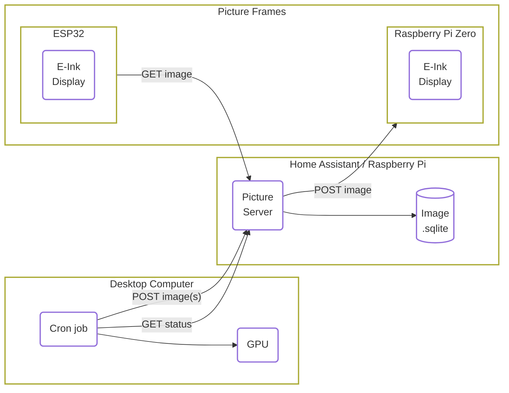

We built an **e-ink picture frame** using an **ESP32** microprocessor that shows a new daily piece of artwork created by a **local AI diffusion model**.
Each day brings a random and unique image to enjoy. Everything runs on our local network, keeping everything private and off the cloud. It’s simple to have dynamic, AI-generated art on your walls without compromising privacy. Plus, the whole setup fits into our Home Assistant smart home system, which handles the image server and keeps track of the ESP32s.


**Figure:** The transition of e-ink screen, lasting around 3sec.

| a | b |
| --- | --- |
|  |  |

**Figure a:** Art gallery with 5 e-ink screen synced with the same AI model and prompt. **Figure b:** The back side of the setup with ESP32 and battery.

### Want to build your own? Here’s how.
If you’re aiming for wireless picture frames, the ESP32 chip is the way to go, though it does require some soldering.
If you’d rather avoid the soldering, you can always use a Raspberry Pi Zero, leaving you with a cable coming out of your frame.

In some areas, we go all in (like with dithering algorithms), while in others, we take shortcuts (like writing yaml instead of C-code).
After all, [we need to finish our projects](https://www.youtube.com/watch?v=4jgTCayWlwc).

## Hardware Requirements

Here’s what you’ll need:

- A computer with a **decent graphics card** to generate AI images
- An **E-ink screen** and an E-ink screen HAT
- For wireless or battery-powered setups: an **ESP32 chip** and a LiPo battery
- For wired setups or if you don’t want to solder: a **Raspberry Pi Zero**
- Optionally, a **Raspberry Pi 5** to host an image server

And you should be comfortable with:

- Python programming
- Basic Linux (shell) commands
- Soldering

While a Raspberry Pi Zero is the best choice for the picture frame due to its size, any Raspberry Pi model will work just fine.
Specifiably, the items we got were:

| Item | Product Link | Price |
| --- | --- | --- |
| DFRobot FireBeetle2 ESP32-S3 N16R8 8MB PSRAM [wiki](https://wiki.dfrobot.com/SKU_DFR0975_FireBeetle_2_Board_ESP32_S3) | [https://www.dfrobot.com/product-2676.html](https://www.dfrobot.com/product-2676.html)| ~ 20 EUR |
| DFRobot FireBettle2 ESP32-E N16R2 2M PSRAM  [wiki](https://wiki.dfrobot.com/_SKU_DFR1139_FireBeetle_2_ESP32_E_N16R2_IoT_Microcontroller) | [https://www.dfrobot.com/product-2837.html](https://www.dfrobot.com/product-2837.html) | ~ 15 EUR |
| 1500-5000 mAh LiPo Battery with JST PH 2 Pin connector | | ~ 7 EUR |
| Raspberry Pi 5 | [https://www.raspberrypi.com/products/raspberry-pi-5/](https://www.raspberrypi.com/products/raspberry-pi-5/) | ~120 EUR |
| Raspberry Pi Zero | [https://www.raspberrypi.com/products/raspberry-pi-zero/](https://www.raspberrypi.com/products/raspberry-pi-zero/) | ~12 EUR |
| Waveshare E-ink 13.3" K, with HAT | [https://www.waveshare.com/13.3inch-e-paper-hat-k.htm](https://www.waveshare.com/13.3inch-e-paper-hat-k.htm) | ~150 EUR |

The estimated total cost per ESP32-based frame is around 180 EUR, excluding the cost of the physical frame. The e-ink display is the most expensive component.

We chose ESP32 after browsing this list of compatible devices on PlatformIO.
[registry.platformio.org/platforms/platformio/espressif32/boards?version=5.3.0](https://registry.platformio.org/platforms/platformio/espressif32/boards?version=5.3.0).
The version is locked to 5.3.0 because, at the time of writing, ESPHome uses `platformio=5.3.0`.
The key requirement is that the ESPHome [`online_image`](https://esphome.io/components/online_image.html) component needs PSRAM to download the PNG image over Wi-Fi.

If you're based in Switzerland, check out [bastelgarage.ch](https://www.bastelgarage.ch).
Otherwise, a local hobby electronics store in your country will likely carry most of the parts.
Unfortunately, we couldn’t find a supplier for the Waveshare 13.3" black/white e-ink display ([Waveshare 13.3" black/white e-ink display](https://amzn.to/4im9Wjj)), so we ordered it from Amazon.

## Software/Service Overview

To keep everything organized and make the workflow easy to manage, we divided the tasks into three main sections:
- generating images
- storing images
- displaying images

We use our desktop computer with a graphics card to generate images on the fly or through a scheduled job.
We both created different versions of the workflow. You can check out Jimmy’s version at [github.com/charnley/eink-art-gallery](https://github.com/charnley/eink-art-gallery).




The workflow works like this:

- The **picture server** holds a list of AI prompts, each with its associated images, stored in a SQLite database. For our setup, this is hosted on Home Assistant as an Add-on, but it could easily run on any Docker hosting service.
- Every night, the **desktop computer** checks the picture server for prompts that need images. For all of those prompts, the desktop computer generates new images and sends them to the server.
- The **ESP32-powered picture frame(s)** follow a sleep schedule, staying off for 24 hours and waking up at 4 am. When it wakes up, it requests a picture, displays it, and then goes back to sleep.
- The **Raspberry Pi-powered picture frame(s)** host an API for displaying images, so you can send live notifications or images directly to the frame.

The services work seamlessly together and can be easily customized to fit personal needs.
Good separation of concern makes it easier to debug.


## Why and what E-ink?

There are two main reasons we chose e-ink: it looks like a drawing and consumes very little power. But beyond that, it just looks amazing and I’ve yet to meet anyone who realizes it's screen technology without an explanation. And honestly, I’m always happy to provide that explanation.

What makes it look so realistic is that it’s using ink. You'll know exactly what I mean if you’ve ever used a Kindle or a Remarkable Tablet. The screen comprises tiny "pixels" filled with oil and pigments. The pigments are moved up or down using an electromagnet, which determines the color of each pixel.

Want to learn more? Check out this Wikipedia page on E-Ink [wikipedia.org/wiki/E_Ink](https://en.wikipedia.org/wiki/E_Ink) and this one on electronic paper [wikipedia.org/wiki/Electronic_paper](https://en.wikipedia.org/wiki/Electronic_paper).

Several providers are out there, but the E-ink supplier we’ve gone with is Waveshare. We chose them because others have had good experiences with their products, they offer solid documentation, and their prices are reasonable. In particular, we found the 13.3-inch black-and-white screen to be the perfect fit for our needs, especially when you consider the price versus size. You can check it out here
[waveshare.com/13.3inch-e-paper-hat-k.htm](https://www.waveshare.com/13.3inch-e-paper-hat-k.htm).

The prices can rise quickly as the screen size increases, but we didn’t want to go with the standard 7.5-inch screen—it would look way too small on the wall. We preferred to compromise and go with a larger, though lower-resolution, black-and-white screen. Even with its lower resolution, the 13.3-inch screen fits perfectly and blends seamlessly into our living rooms.

The screen operates via GPIO pins and binary commands. For the Raspberry Pi, it's pretty much plug-and-play. For the ESP32, however, you'll need to solder each pin and set up the GPIO configuration.

| PIN | Description |
| --- | --- |
| VCC | Power positive (3.3V power supply input) |
| GND | Ground |
| DIN | SPI's MOSI, data input |
| SCLK | SPI's CLK, clock signal input |
| CS | Chip selection, low active |
| DC | Data/Command, low for command, high for data |
| RST | Reset, low active |
| BUSY | Busy status output pin (indicating busy) |
| PWR | Power on/off control |

You can choose which pins go where in the soldering configuration, but VCC and GND are fixed.
The PWR pin is a recent addition to the HAT and controls the power for the E-ink screen. The easiest way to configure this is by soldering it directly to a 3.3 V endpoint on the ESP32.

Another reason we chose this brand of e-ink display is that ESPHome drivers are now available, making it much quicker to get everything up and running. Plus, plenty of examples are out there to help you get started. Mind you, most of these examples are for the 7.5-inch model.

> **NOTE:** We also explored the Black-White-Red E-ink display from Waveshare ([13.3" E-Paper HAT-B](https://www.waveshare.com/13.3inch-e-paper-hat-b.htm)), but it required more effort to get it working with ESPHome. Additionally, it takes about 30 seconds to switch pictures, compared to just 3 seconds with the black-and-white version.

## Hosting an AI art model

We set up a Python environment on our desktop computer to populate our local image library to access a graphics card/GPU.
While having a powerful graphics card isn’t crucial, it does make a difference if you want to generate live prompts.
However, it doesn’t matter if image generation takes 20 minutes or more for a nightly cron job.

### Selecting an AI model

You can choose any AI model you like here. We tried out many models throughout 2024, always experimenting with the latest ones, but in the end, it didn’t make a significant difference for this project.

We ultimately settled on 
[Stable Diffusion 3.5](https://stability.ai/news/introducing-stable-diffusion-3-5), because it was easy to set up and compatible with our hardware. On a NVIDIA GTX 1080p graphics card, it takes about 15 minutes per image, while with a NVIDIA GTX 4090, it only takes about 3 seconds. We used Huggingface to set up the model, which requires registration to access Stable Diffusion 3.

### Image Prompts for Best Results

We've learned a few lessons about prompts.
The most important one is that if you want the art to look good on a black-and-white E-ink screen, you need to choose styles that work well in that format — think high contrast, grayscale, and, ideally, prompts with an artistic format (like paintings and drawings).

For example, if you prompt for something like "adventurous sci-fi structure, forest, Swiss Alps," the diffusion model will likely default to a photorealistic style, which doesn’t translate well to e-ink. To get better results, you’ll need to add something like "pencil sketch" or "ink droplet style" to guide the model toward a look that fits the e-ink display. Anything related to drawing, painting, or sketching tends to work well.


**Figure:** Showing the results of prompting "winter forest in alps", without (a) and with (b) e-ink friendly keywords, and the results after dithering (c and d).

Several style libraries are available for inspiration. We found [midlibrary.io](https://midlibrary.io/) to offer a great selection of styles and artists that work well, especially in the black-and-white section. Some styles are more ethical than others, but as a non-commercial home project, we leave you to draw your own lines in the sand.

Below are some styles that work well with a motif, such as "simplistic line art, skier in Swiss Alps."

<details markdown="1">
<summary><b>Image prompt styles that work well on e-ink formats</b></summary>

    simplistic line art
    assembly drawing
    brush pen drawing, white background
    circut diagram
    coloring book page, white background
    coloring-in sheet, white background
    elevation drawing
    ink drawing, white background
    one line art
    one line, black and white, drawing
    parametric drawing
    pen drawing, white background
    schematics
    silhouette
    stippling
    sumi-e drawing, white background
    wireframe

</details>

### Hosting Image Generator Service on Windows

Since you're following this setup guide, it’s assumed that you have a graphics card and are using a Windows machine.
The easiest way to set up the service is using Windows Subsystem for Linux (WSL).
There were some speed issues with Windows 10 and WSL2, mainly due to the disk's slow read/write speeds.
However, using Windows 11 with WSL2 seems much more stable.
Just so you know, you'll need more space than you might expect to set up the Linux subsystem.

With Windows 11 and WSL2, getting CUDA access to the Windows GPU from Linux is relatively smooth.
Here’s a setup guide to get started:

<details markdown="1">
<summary><b>Setup Linux subsystem linux with CUDA</b></summary>

- Install CUDA on Windows (you probably already have that) [developer.nvidia.com/cuda-downloads](https://developer.nvidia.com/cuda-downloads)
- Install WSL [learn.microsoft.com/en-us/windows/wsl/install](https://learn.microsoft.com/en-us/windows/wsl/install)

Open PowerShell or Windows Command Prompt in **administrator** mode and install wsl

    wsl --install

When WSL is installed, update and set up Linux (following the guide will install Ubuntu). You enter the Linux subsystem by

    wsl

Then you can use Bash in Linux. First update your system;

    # update apt
    sudo apt update
    sudo apt upgrade

Download CUDA bridge from
[developer.nvidia.com/cuda-downloads?target_os=Linux&target_arch=x86_64&Distribution=WSL-Ubuntu&target_version=2.0&target_type=deb_network](https://developer.nvidia.com/cuda-downloads?target_os=Linux&target_arch=x86_64&Distribution=WSL-Ubuntu&target_version=2.0&target_type=deb_network)
and select; Linux, x86, WSL-Ubuntu, 2.0, deb (network). As of writing, this means the following wget

```bash
wget https://developer.download.nvidia.com/compute/cuda/repos/wsl-ubuntu/x86_64/cuda-keyring_1.1-1_all.deb
sudo dpkg -i cuda-keyring_1.1-1_all.deb
sudo apt update
sudo apt -y install cuda-toolkit-12-3
```

Lastly, set up Python with `conda`, `uv`, or `pip`. We will assume you know how to do that. Then, you can set up any Python-based Huggingface model. The choice is yours.

</details>

This setup allows you to run a Python environment with CUDA in a Linux subsystem on Windows.
Once the Linux subsystem is set up, you can configure a job to run your service daily at 4 am.
To do this, use `crontab -e`on WSL and add the following syntax:

```crontab
30 4 * * * cd ~/path/to/project && start-service
```

> **NOTE:** WSL2 will shut down if no shell is running, so you’ll need to leave a terminal open on your machine.

## Dithering: Converting Grayscale Images to Black-and-White

When converting a grayscale image to black-and-white (binary), we lose subtle gray shades.
To handle this, dithering (or error diffusion) is used.
This technique helps simulate grayscale by spreading the error from converting a pixel to black or white across nearby pixels.
More details can be found [en.wikipedia.org/wiki/Dither](https://en.wikipedia.org/wiki/Dither).

The most common dithering method is [Floyd-Steinberg dithering](https://en.wikipedia.org/wiki/Floyd%E2%80%93Steinberg_dithering).
It calculates each pixel's error (the difference between its gray value and black/white) and distributes it to surrounding pixels.
This creates the illusion of more shades and smoother transitions, even in a binary image.

Starting from the top-left corner and moving through each pixel, the error is diffused to neighboring pixels. If $$*$$ represents the current pixel, the error is spread out like this:

$$
\begin{bmatrix}
         &                                          & *                                        & \frac{\displaystyle 7}{\displaystyle 16} & \ldots \\
  \ldots & \frac{\displaystyle 3}{\displaystyle 16} & \frac{\displaystyle 5}{\displaystyle 16} & \frac{\displaystyle 1}{\displaystyle 16} & \ldots \\
\end{bmatrix}
$$

However, in practice, the numerically correct method often produces an image that looks overly "grayish" because it creates dense black-and-white pixel patterns. While this is technically accurate, it doesn't look as clean or sharp, especially on low-resolution displays.

Through experience, we found that the [Atkinson Dithering](https://en.wikipedia.org/wiki/Atkinson_dithering) works much better for low-resolution images.
The difference is that Atkinson diffuses only part of the error, which helps avoid the harsh black-and-white patterns and leads to a cleaner, more visually pleasing result.

If $$*$$ represents the current pixel, the error is spread out like this:

$$
\begin{bmatrix}
  &  & *  & \frac{\displaystyle 1}{\displaystyle 8} & \frac{\displaystyle 1}{\displaystyle 8} \\
  \ldots & \frac{\displaystyle 1}{\displaystyle 8} & \frac{\displaystyle 1}{\displaystyle 8} & \frac{\displaystyle 1}{\displaystyle 8} & \ldots \\
  \ldots &  & \frac{\displaystyle 1}{\displaystyle 8} &  & \ldots \\
\end{bmatrix}
$$

The result is that the image will have more concentrated pixel areas and higher contrast. This is evident in the following comparison:


**Figure:** a) A grayscale image, b) dithering using Floyd-Steinberg, and c) using Atkinson Dithering.

It might be subtle, but notice how (b) appears more grayish than (c).
This difference is much more noticeable on an actual, physical, low-res e-ink screen.

Atkinson dithering isn't implemented in Pillow (yet), which only supports Floyd-Steinberg. Since the process involves many for-loops, Python isn't the most efficient choice. However, using Numba (JIT), we can speed things up and quickly get a working solution. As seen in:

<details markdown="1">
<summary><b>Atkinson Dithering Python Implementations</b></summary>

```python
import numpy as np
from numba import jit
from PIL import Image

def atkinson_dither(image: Image.Image) -> Image.Image:
    img = np.array(image.convert("L"), dtype=np.int32)
    set_atkinson_dither_array(img)
    return Image.fromarray(np.uint8(img))

@jit
def set_atkinson_dither_array(img: np.ndarray):
    """changes img array with atkinson dithering"""

    low = 0
    heigh = 255

    frac = 8  # Atkinson constant
    neighbours = np.array([[1, 0], [2, 0], [-1, 1], [0, 1], [1, 1], [0, 2]])
    threshold = np.zeros(256, dtype=np.int32)
    threshold[128:] = 255
    height, width = img.shape
    for y in range(height):
        for x in range(width):
            old = img[y, x]
            old = np.min(np.array([old, 255]))
            new = threshold[old]
            err = (old - new) // frac
            img[y, x] = new
            for dx, dy in neighbours:
                nx, ny = x + dx, y + dy
                if 0 <= nx < width and 0 <= ny < height:
                    # Make sure that img set is between 0 and 255 (negative error could surpass the value)
                    img_yx = img[ny, nx] + err
                    img_yx = np.minimum(heigh, np.maximum(img_yx, low))
                    img[ny, nx] = img_yx
```

</details>

> **NOTE:** If you're working with multiple colors, you can diffuse the error for each color channel. You can also extend error diffusion to handle multiple levels of gray, not just black and white. Examples can be found in the GitHub repo.

## Displaying the image

We have two options for displaying the image on the e-ink: push with a power cable or pull with a battery.

The first iteration was done with a Raspberry Pi, but because it required a USB power cable, it removed the immersion as a photo frame.
Note that a white USB cable was used, and only one person ever noticed it. However, we knew it was there, and that was enough.
But if you want live updates, like notifications, this is the option you want.

The second option uses an ESP32 microprocessor, which can be battery-powered with no visible cords.

### Setting up Raspberry Pi API frame

For the Raspberry Pi, the simplest setup would be to set up a FastAPI Python client to receive requests and display them.
We use an [Raspberry Pi Zero](https://www.raspberrypi.com/products/raspberry-pi-zero/) because of the small form factor to be hidden behind the frame.
Waveshare provides quite good example codes for Python (and other implementations) and is easily the fastest way to get something displayed on your screen.
[github.com/waveshareteam/e-Paper](https://github.com/waveshareteam/e-Paper). 

For the Raspberry Pi, [install Debian OS](https://www.raspberrypi.com/documentation/computers/getting-started.html) and `ssh` into it. 

<details markdown="1">
<summary><b>Setting up Raspberry Pi</b></summary>

```bash
# Enable SPI
# Choose Interfacing Options -> SPI -> Yes
sudo raspi-config
sudo reboot

# Setup Python and dependencies
sudo apt install python3-pip python3-setuptools python3-venv python3-wheel libopenjp2-7

# Create a python env
python3 -m venv project_name

# Activate python env
source ./project_name/bin/activate

# Install the main dependencies with the activated env, but really, use a git repo for this
pip install pillow numpy RPi.GPIO spidev gpiozero spidev
```
</details>

If you have a problem creating a `venv`, because of missing pip, you can;

    python3 -m venv --without-pip project_name
    source env/bin/activate
    wget bootstrap.pypa.io/get-pip.py
    python get-pip.py

With this setup, setting up a FastAPI solution to display images should be straightforward.
For inspiration, you can refer to Jimmy's github solution [github.com/charnley/eink_art_gallery](https://github.com/charnley/eink_art_gallery).

Note, because you need to start the API every time the Raspberry Pi is booted, it is worth setting up a `crontab -e` to start you service at boot

    @reboot /path/to/your_script.sh


### Setting up ESPHome and ESP32 frame

Why use `YAML` instead of `C`? At some point, the project needs to end. We opted for ESPHome `YAML` , as we both use Home Assistant, and it made sense to leverage the convenience of ESPHome to get all the free features right out of the box. Sometimes, it’s best to choose your battles and focus on completing the project.

ESPHome is a YAML-based configuration that generates the binaries needed to flash devices. Rather than writing  code, you configure devices by setting up modules in YAML format. It’s a bit like building with Lego blocks for your ESP32 devices.
While the ESPHome ecosystem includes drivers for most WaveShare E-Ink displays, we encountered a gap. Specifically, the driver for the 13.3" black-and-white display we wanted to use wasn’t available. So, Peter took the initiative and wrote the necessary drivers, which you can find in
[github.com/esphome/esphome/pull/6443](https://github.com/esphome/esphome/pull/6443)

There are an overwhelming number of ESP32 options. Initially, we tried the Waveshare ESP32 development board, which can display images.
[waveshare.com/e-paper-esp32-driver-board.htm](https://www.waveshare.com/e-paper-esp32-driver-board.htm).
However, we ran into an issue: the standard ESPHome [component](https://esphome.io/components/online_image.html) couldn’t download images over the Internet. This functionality requires [PSRAM](https://docs.espressif.com/projects/esp-idf/en/latest/esp32/api-guides/external-ram.html) on the ESP32.

After testing a few options, we found that the [FireBettle2 ESP32-E](https://wiki.dfrobot.com/_SKU_DFR1139_FireBeetle_2_ESP32_E_N16R2_IoT_Microcontroller) and [FireBettle2 ESP32-S3](https://wiki.dfrobot.com/SKU_DFR0975_FireBeetle_2_Board_ESP32_S3) feature PSRAM and are well-documented by the manufacturer. These models turned out to be reliable choices for our project.

To connect the ESP32 to the [E-Paper Driver HAT](https://www.waveshare.com/wiki/E-Paper_Driver_HAT), you’ll need to map the GPIO pins on the ESP32 to those defined by the Waveshare HAT. The soldering process is straightforward. For your reference, we’ve provided an example configuration for the FireBettle 2 ESP32-E GPIO-to-Waveshare HAT GPIO pin mapping in the table below:

| WS HAT PIN  | ESP32-E PIN | Description |
| ---  | ---     |--- |
| PWR  | 3v3     | Power on/off control |
| BUSY | 4/D12   | Busy status output pin (indicating busy) |
| RST  | 14/D6   | Reset, low active |
| DC   | 13/D7   | Data/Command, low for command, high for data |
| CS   | 15/A4   | Chip selection, low active |
| CLK  | 18/SCK  | SPI's CLK, clock signal input |
| DIN  | 23/MOSI | SPI's MOSI, data input |
| GND  | GND     | Ground |
| VCC  | 3v3     | Power positive (3.3V power supply input) |

The configuration that worked for us with the FireBettle2 ESP32-E and FireBettle2 ESP32-S3 boards is as follows (as defined by the ESPHome substitutions in the YAML file). Keep in mind that GPIO pins often have multiple names. You'll need to consult the manufacturer's documentation to identify the physical GPIO pin on the ESP32. In this case, FireBettle provides detailed wikis, which are great resources for getting the pin mappings correct.

The example below assumes you've set up an add-on/Docker service within Home Assistant. However, the URL can be anything accessible on your local network, as long as the payload is a PNG image with the correct resolution. For the 13.3" K model, the required resolution is 960x680 pixels.

<details markdown="1">
<summary><b>GPIO Configuration for FireBettle2 ESP32-E</b></summary>

```yaml
substitutions:
  device_id: "example_e"
  wifi_ssid: !secret wifi_ssid
  wifi_password: !secret wifi_password
  wake_up_time: "04:00:00"
  image_url: "http://homeassistant.local:8090/displays/queue.png"

  busy_pin: "GPIO04" # 4/D12
  reset_pin: "GPIO14" # 14/D6
  dc_pin: "GPIO13" # 13/D7
  cs_pin: "GPIO15" # 15/A4
  clk_pin: "GPIO18" #  18/SCK
  mosi_pin: "GPIO23" # 23/MOSI

  waveshare_model: "13.3in-k" # or another waveshare model

esp32:
  board: esp32dev # dfrobot_firebeetle2_esp32e
  framework:
    type: arduino
    version: recommended

esphome:
  name: eink-frame-${device_id}
  friendly_name: "eink frame ${device_id}"
  platformio_options:
    build_flags: "-DBOARD_HAS_PSRAM"
```

</details>

<details markdown="1">
<summary><b>GPIO Configuration for FireBettle2 ESP3S3</b></summary>

```yaml
substitutions:
  device_id: "example_s"
  wifi_ssid: !secret wifi_ssid
  wifi_password: !secret wifi_password
  wake_up_time: "04:00:00"
  image_url: "http://homeassistant.local:8090/displays/queue.png"

  clk_pin: "GPIO12"
  mosi_pin: "GPIO11"
  cs_pin: "GPIO10"
  dc_pin: "GPIO9"
  busy_pin: "GPIO7"
  reset_pin: "GPIO4"

  waveshare_model: "13.3in-k" # or another waveshare model

esp32:
  board: dfrobot_firebeetle2_esp32s3
  framework:
    type: arduino
    version: recommended
```

</details>

Once you’ve soldered the ESP32 with connectors, it’s time to bring it to life by flashing it with ESPHome. To set up ESPHome, you’ll need a Python environment. Install ESPHome via pip to get started.

```bash
pip install esphome
```

Next, set up a `secrets.yaml` file with your Wi-Fi name and password.

```yaml
wifi_ssid: YourWiFiSSID
wifi_password: YourWiFiPassword
```

Once the setup is complete, flash the ESP32 with ESPHome using the following command:

```bash
esphome run --device /dev/ttyACM0 ./path/to/configuration.yaml
```

The device will be mounted on `/dev/ttyACM0` or `/dev/ttyUSB0`, with the number (0-2) indicating the specific device.
Be sure to define the device argument when flashing; otherwise, ESPHome will attempt to flash over Ethernet using the device name.

With the GPIO soldered and configured, you can now experiment with different ESPHome configurations.
Combine the device-specific substitutions above with the following functionality.
We’ve included two example configurations that helped us debug. For more, check out our GitHub project.

Here’s a simple yaml configuration to connect to Wi-Fi, download an image, display it, and sleep for 24 hours. The variables are defined as substitutions above.

```yaml
http_request:
  id: fetch_image_request
  timeout: 5s
  useragent: esphome/example_device
  verify_ssl: false

wifi:
  ssid: !secret wifi_ssid
  password: !secret wifi_password
  on_connect:
    - component.update: my_image

logger:
  baud_rate: 115200
  level: VERY_VERBOSE

online_image:
  - url: $image_url
    id: my_image
    format: png
    type: BINARY
    on_download_finished:
      then:
        - component.update: my_display
        - logger.log: "Downloaded image"
    on_error:
      then:
        - logger.log: "Error downloading image"

spi:
  clk_pin: $clk_pin
  mosi_pin: $mosi_pin

display:
  - platform: waveshare_epaper
    id: my_display
    cs_pin: $cs_pin
    dc_pin: $dc_pin
    busy_pin: $busy_pin
    reset_pin: $reset_pin
    reset_duration: 200ms
    model: $waveshare_model
    update_interval: never
    lambda: |-
      it.image(0, 0, id(my_image), Color::BLACK, Color::WHITE);
      ESP_LOGD("display", "Image displayed successfully");

deep_sleep:
  run_duration: 40s
  sleep_duration: 25200s # 7h
```

For a more advanced configuration that:

- Wakes up at 4 am
- Connects to Wi-Fi
- Attempts to download an image
- Displays an "X" if the image download fails
- Displays the image on success
- Send an estimate of the battery level to Home Assistant

The configuration would look like the following yaml.

<details markdown="1">
<summary><b>Advanced ESPHome configuration</b></summary>

```yaml
deep_sleep:
  id: deep_sleep_control
  run_duration: 40sec

time:
  - platform: homeassistant
    id: homeassistant_time

logger:
  baud_rate: 115200
  level: DEBUG

wifi:
  ssid: !secret wifi_ssid
  password: !secret wifi_password
  power_save_mode: light
  on_connect:
    - logger.log: WiFi is connected!
    - logger.log: "Trying to download ${image_url}"
    - component.update: my_image

captive_portal:

online_image:
  - url: $image_url
    id: my_image
    format: png
    type: BINARY
    on_download_finished:
      then:
        - logger.log: "Downloaded image, updating display"
        - display.page.show: page1
        - component.update: my_display
        - delay: 7s
        - deep_sleep.enter:
            id: deep_sleep_control
            until: "${wake_up_time}"
            time_id: homeassistant_time
    on_error:
      then:
        - logger.log: "Error downloading image $(image_url)"
        - display.page.show: page2
        - component.update: my_display
        - delay: 7s
        - deep_sleep.enter:
            id: deep_sleep_control
            until: "${wake_up_time}"
            time_id: homeassistant_time

spi:
  clk_pin: $clk_pin
  mosi_pin: $mosi_pin

display:
  - platform: waveshare_epaper
    id: my_display
    cs_pin: $cs_pin
    dc_pin: $dc_pin
    busy_pin: $busy_pin
    reset_pin: $reset_pin
    reset_duration: 200ms
    model: $waveshare_model
    update_interval: never
    pages:
      - id: page1
        lambda: |-
          it.image(0, 0, id(my_image), Color::BLACK, Color::WHITE);
          ESP_LOGD("display", "Image displayed successfully");
      - id: page2
        lambda: |-
          it.line(0, 0, 50, 50);
          it.line(0, 50, 50, 0);
          ESP_LOGD("display", "Error Image displayed successfully");

api:
   on_client_connected:
     then:
       - sensor.template.publish:
           id: battery_level
           state: !lambda "return id(battery_level).state;"
       - sensor.template.publish:
           id: battery_voltage
           state: !lambda "return id(battery_voltage).state;"

ota:
  - platform: esphome

 sensor:
   - platform: adc
     pin: VDD
     name: "Battery Voltage"
     id: battery_voltage
     update_interval: 60s
     attenuation: auto
     unit_of_measurement: "V"
     accuracy_decimals: 2

   - platform: template
     name: "Battery Level"
     id: battery_level
     unit_of_measurement: "%"
     accuracy_decimals: 0
     lambda: |-
       float voltage = id(battery_voltage).state;
       if (voltage < 3.0) return 0;
       if (voltage > 4.2) return 100;
       return (voltage - 3.0) / (4.2 - 3.0) * 100.0;

binary_sensor:
  - platform: status
    name: "${device_id} Status"
    id: device_status
```
</details>

> **NOTE:** The image you are downloading must be in PNG format (the only format supported by ESPHome online_image component) and should match the exact image size — 960x680 in our case.

> **Note:** If your image appears greyish or less visible, especially with more complex images, you may use the wrong display configuration. For troubleshooting, refer to the Waveshare E-Paper Driver HAT guide.
> [waveshare.com/wiki/E-Paper_Driver_HAT](https://www.waveshare.com/wiki/E-Paper_Driver_HAT).

> **Note:** If your image doesn’t refresh completely when switching photos, check your soldering connections. A loose connection could be the cause.

## Battery choice

The final step for our project is choosing a suitable battery. The key criteria were: we didn’t want to take the frame down to recharge frequently, and the battery needed a slim form factor to fit behind the photo frame.

To determine the necessary mAh for a LiPo battery, we first calculated the daily power consumption, which we divided into two parts: deep-sleep power consumption and per-image switch consumption.

We used a USB-C ammeter to measure the peak current for the image switch consumption. To simplify, we noted the peak, though a better approach would be to place a voltmeter in the chain between the battery and the device. But, as with many things, we took the easier route.

The peak current during a picture change was measured to be 0.128 Ampere.

For the deep-sleep consumption, the usage was so low that we couldn’t measure it with our ammeter. However, after some research, we found that the ESP32 consumes only 10 µA during deep sleep, according to Espressif’s datasheet.
[espressif.com/sites/default/files/documentation/esp32_datasheet_en.pdf](https://www.espressif.com/sites/default/files/documentation/esp32_datasheet_en.pdf).

As a reminder, for the calculations below, Watt equals 1 joule per second, and 24 hours equals 86,400 seconds.

$$
\begin{align}
     E_\text{Battery} &= \frac{\text{[Battery mAh]} \cdot \text{[Battery Voltage]}}{1000} \cdot 3600 \text{ Joule / Wh}\\
     &= \left (1500 \text{mAh} \cdot 3.3 \text{V} \right ) / 1000 \cdot 3600 \text{J/Wh} = \underline{17820 \text{ Joule}}\\
    E_\text{picture change} &= \text{Voltage} \cdot \text{Ampere} \cdot \text{Time}\\
    &= 3.3 \text{V} \cdot 0.128\text{A} \cdot 20\text{sec} = \underline{8.4 \text{ Joule}}\\
    E_\text{daily sleep} &= 3.3 \text{V} \cdot 0.00001 \text{A} \cdot 86400 \text{sec} = \underline{2.85 \text{ Joule}}\\
    \text{Battery Life} &= \frac{E_\text{Battery} }{(E_\text{daily sleep} + N \cdot E_\text{picture change})} \\
                 &= \frac{19980 \text{ J}}{\left (3.2 + 1 \cdot 9.5 \right ) \text{J/day}} \approx 1500 \text{ days} \approx 4 \text{ years}
\end{align}
$$

Where $$N$$ is the number of picture changes per day, in our case, it’s just once per night.

This leads to the conclusion that, with only one picture change per day, the battery should theoretically last 4 years, which, as we know, seems unrealistic. Keep in mind that LiPo batteries have a natural self-discharge rate of 1-5% per month (citation needed).

For the lazy, here’s a Python function to help with the calculation:

<details markdown="1">
<summary><b>battery_lifetime.py</b></summary>

```python
def battery_lifetime(
    battery_mah: int, # mAh
    switch_per_day: int,
    switch_ampere: float = 0.128, # ampere
    switch_time: float = 20, # sec
):
    battery_voltage = 3.3
    sleep_ampere = 0.00001
    daily_seconds = 86400
    e_battery = (battery_mah * battery_voltage)/1000 * 3600
    e_picture_change = battery_voltage * switch_ampere * switch_time
    e_daily_sleep = battery_voltage * sleep_ampere * daily_seconds
    days = (e_battery)/(e_daily_sleep + switch_per_day*e_picture_change)
    return days
```

</details>

> **NOTE:** The battery you purchase will likely not arrive with the correct +/- configuration or JST connector size. Do not let the +/- ends touch each other when switching the cables unless you’re prepared to order a new battery.

## Mounting on the frame

You have a few options when mounting the project on the back of your frame.
For those who want to go full overkill, follow Peter’s lead and create a custom 3D-printed mount to be glued to the backside.

| a | b |
|  |  |

If you don’t have a 3D printer, you can do what Jimmy did: use M2 screws and M2 x5mm spacers, hot-glued to the backside. Screw in the screws and spacers onto the device, then secure it to the frame using hot glue.

| a | b |
|  |  |

Both methods allow you to remove the device easily for debugging or maintenance. Some people online have been seen hot-gluing the device directly to the back of the frame, which is a bit extreme… don’t do that.

Use a passepartout (the white border around the display) to give your setup a more professional look.
These typically come with frames, but be aware that the default 30x40cm passepartout we found locally only showed the black outline of the screen.
Ultimately, we had to get a custom-cut passepartout, which could be expensive but gave the setup the final touch, making it look like an actual painting.


## The result


**Figure:** Setup using Raspberry Pi (with power cable), and the black/white/red WaveShare e-ink screen.


**Figure:** Setup when the image queue is out of images.


**Figure:** Setup of synced prompts.

## Note on the next version

Finishing this project was challenging, as there's always more to do.
Eventually, we had to say, "Stop." But for the next version, we’re excited to explore several new ideas:

- **Using the `ollama` models to generate prompts** for picture generation based on themes. For example, if we’re celebrating a birthday, the prompts could focus on party-themed art, birthday cakes, balloons, and other festive elements.
- **ESP32 and ZigBee-based live updates**, utilizing ZigBee for wake-on-demand, making the ESP32 push-friendly, while still having a cable-free setup and long battery life.
- The new Waveshare 13.3-inch e-paper screen has a **higher resolution and supports full color**. This would be a fantastic upgrade, but it requires diving deeper into making ESPHome work with this new interface. [waveshare.com/product/displays/e-paper/epaper-1/13.3inch-e-paper-hat-plus-e.htm](https://www.waveshare.com/product/displays/e-paper/epaper-1/13.3inch-e-paper-hat-plus-e.htm).
- Using a webcam or pre-defined pictures to **generate images of guests visiting**, similar to the concept in InfiniteYou. [github.com/bytedance/InfiniteYou](https://github.com/bytedance/InfiniteYou).
- Enhancing the system with **better `matplotlib` infographics** and local weather integration, for example, knowing when it’s snowing and integrating with Home Assistant to recommend when and where to go skiing.


## Thanks

Ananda, for offering valuable answers when we hit technical roadblocks.
Kristoffer, for proofreading this page.
Patrick, for handling the soldering.
