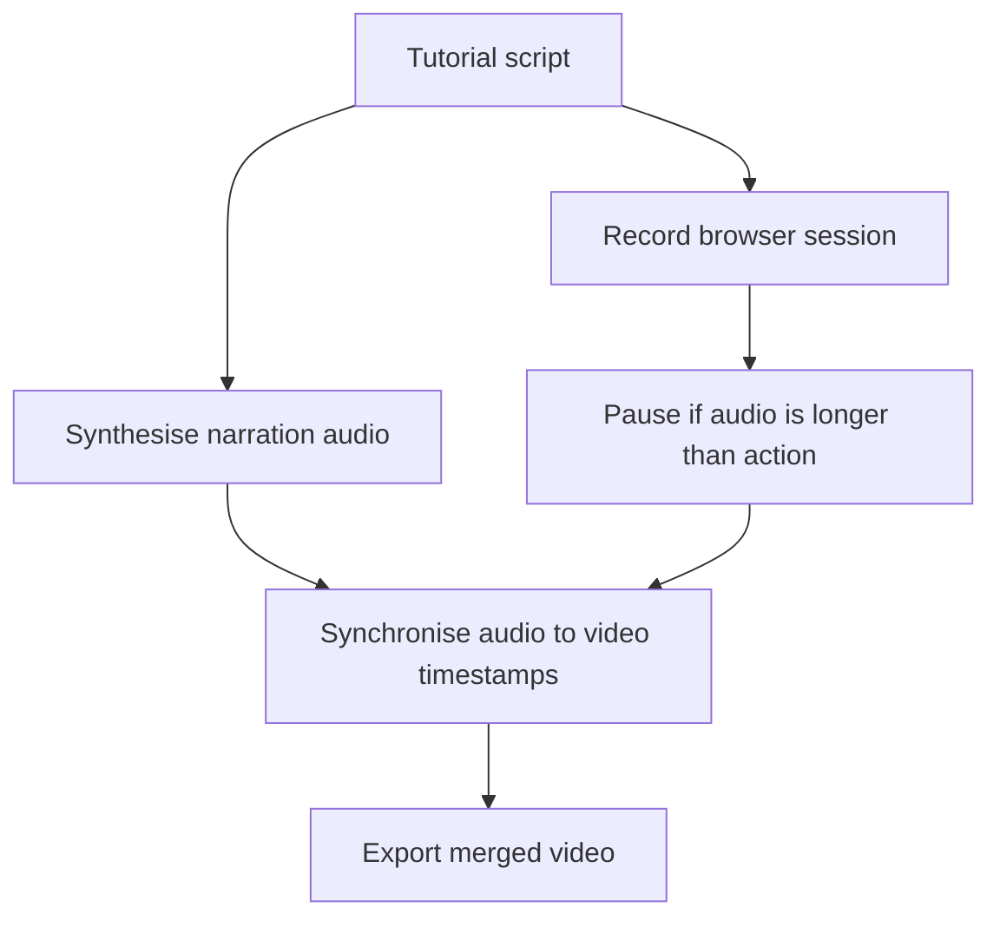

tldr:
tutorials-as-code.
Using `playwright` for end-to-end browser testing, and overlaying text-to-speech using `Piper`',
we can create automated tutorials, every time the user interface or application changes.
Example code: [github.com/charnley/example-tutorial-as-code](https://github.com/charnley/example-tutorial-as-code).

> **Play with sound**
<!-- > <video style="max-width:100%" controls playsinline src="{{site.baseurl}}/assets/images/about_tutorial/localhost_recording_compressed.mp4"></video> -->
> <video style="max-width:100%" controls playsinline src="https://github.com/charnley/blog/raw/refs/heads/main/assets/images/about_tutorial/localhost_recording_compressed.mp4"></video>

# Recording Tutorials are Expensive

I work in a small team.
Like most small teams, documentation is always in the backlog.
Far, far into the backlog.
Constantly fighting proverbial fires and reacting to ad-hoc requests, leaves little time for writing user documentation, let alone recording tutorial videos.

We don’t have the budget for a video crew and voice actors or time to update every time UI updates, so the conventional video tutorials are out of the question.
Someone has to plan, record, narrate, edit, and redo them when flows change.
Even larger teams with dedicated "e-learning" resources tend to produce one-off recordings that go stale quickly.

> "Oh no, don't press that button. Did you watch the tutorial? You shouldn't, sorry, that is outdated now" - Manual Tutorial User

The only tutorials that survive are the ones which are cheap to produce and cheaper to update.
A solution to this is treating them like software artifacts, not media files.
Infrastructure is code. Deployments are code. Tests are code. Tutorials should be too.

What really clicked for me was when a super user of ours recorded himself using an application,
then added speech using Microsoft text-to-speech — thanks Thierry.
My first thought was: "but, I can just automate the recording!".

What we test and what we want to document is usually the same thing.
Add text-to-speech, and suddenly we can turn scripts into reproducible, maintainable tutorial videos without a crew.
"Do more with less", is a fitting sentence I've heard.

> Treating Video Tutorials Like Infrastructure. Tutorial-as-code.

Here's my hot take: Internally developed desktop applications are basically a relic. From what I see, everything is web-based now.
[Playwright](https://playwright.dev/) to record actions plus 
[Piper](https://github.com/OHF-Voice/piper1-gpl)
to record voice overs is all we need.

# Emulating the browser with Playwright

If you don't know [Playwright](https://playwright.dev/),
it is a browser automation and end-to-end testing tool for both JavaScript and Python.
It lets you script real browser interactions — clicks, form fills, navigation — and run them headlessly or with a visible browser window.

For our purposes, we set up a script that pretends to be a user running through a full workflow.
A great starting point is the `codegen` command, which records your manual interactions and outputs the equivalent Playwright code:

```bash
python -m playwright codegen https://localhost:5173/
```

> 

You interact with the browser and your actions appear as generated code in a side panel.
This is especially useful for capturing and codifying longer workflows.
To run a workflow you initialize a browser with a `page` and run actions on it, then record the actions in a video, as seen in this snippet:

```python
from playwright.sync_api import sync_playwright
# Init the browser, with defined outpout video path and browser dimensions.
playwright_obj = sync_playwright().start()
browser = playwright_obj.chromium.launch(headless=True)
viewpoint = {"width": browser_width, "height": browser_height}
context = browser.new_context(record_video_dir=work_dir, viewport=viewpoint, record_video_size=viewpoint)

# Get the page object to apply actions on
page = context.new_page()

# Do actions on `page`
...

# Get the video path of the actions
path  = page.video.path()

# Stop and close playwright, browser and context
...
```

Playwright fills input incredibly fast by default — faster than any human would type. To make the automation feel more natural, 
we should slow things down with pauses and realistic typing speeds.
Adding small delays can improve the flow of demonstrations, especially when narration needs time to keep up. 
In simple cases, using `page.wait_for_timeout` is an effective way to space out actions and create a more human-like pacing.

For convience I created some Playwright specific functions that makes interactions more natural looking.

- **Human typing:** adding random delays to the typing `random.uniform(0.2, 0.5)` as well as random typing errors `random.choice("abcdef")` followed by <kbd>backspace</kbd>.
- **Element highlight:** Add CSS class to an element to highlight it with a blue color `element.evaluate(f"el => el.classList.add('highlight')")`.
- **Remove focus:** Also know as [blur](https://developer.mozilla.org/en-US/docs/Web/API/HTMLElement/blur), which is pretty easy with `page.mouse.click(0, 0)`.

And with that we can pretty naturally navigate through a interface, and output a video.
If something goes wrong you can disable the headless mode and debug it with a `codegen` session.

> **Note:** Playwright works way better in headless mode for recordings.
> If not in headless mode, you will get whitespace around your viewpoint.

> **Note:** Because it can run headless, that also means it works great in a docker-based run.
> Making it very CI/CD-pipeline friendly.

# Emulating voice-over with Piper TTS

> **Edit:** I chose Piper TTS at the point of writing, but [Kitten TTS](https://github.com/KittenML/KittenTTS) looks very promising. Thanks Patrick.

The browser emulation doesn't contain any sound, so we need to generate a overlay narration that goes with each action.
First I looked at `festival` — familiar, `apt`-installable, but the output is more robotic than Microsoft Sam.
Instead I found **Piper TTS**, which seems to be a project that has changed owner quite a few times, but has now landed under the ownership of [Open Home Foundation](https://www.openhomefoundation.org).

<!-- [newsletter.openhomefoundation.org/piper-is-our-new-voice-for-the-open-home](https://newsletter.openhomefoundation.org/piper-is-our-new-voice-for-the-open-home/). -->

This is great, as I am already quite a big fan of Home Assistant and the foundation behind it.
Piper TTS is a fast, local and open-source model for TTS with a big variety of voices and languages.
Even the most romantic European language: Danish.
See [Piper Samples](https://rhasspy.github.io/piper-samples/).

At times it still sounds a bit robotic, but not really distractingly so.
I have found the English voice "Amy" to be a good choice — natural enough that listeners focus on the content rather than the voice.
There is a slight issue with unnatural short breaks between sentences, which I fixed by splitting the narration into one audio file per sentence.

Example:

```text
Hi. This is Amy speaking, presenting MolCalc.
Let's try to make a quantum calculation. Press the search, type in "Pro-pa-nol", then enter.
The molecule is loaded from Cactus.
Then we press "Calculate", and whoop, we have properties.
```

```bash
python -m piper -m en_US-amy-medium -i ./how_to_molcalc.txt -f ./how_to_molcalc.mp3
```

> <audio style="max-width:100%" controls playsinline src="{{site.baseurl}}/assets/images/about_tutorial/amy_hello_molcalc.mp3"></audio>

Does it sound robotic? Slightly, yes — but still impressive for a fully local, offline model.
For extra point in your tutorial, you can even [train your own voice](https://github.com/OHF-Voice/piper1-gpl/blob/main/docs/TRAINING.md).

# Combining the two

The tutorial is written as a list of sections/scenes.
Each section is a pair: what the browser does, and what is narrated.




It is a question of timing.
Browser actions often finish faster than the narration.
If you don't account for that, the next section starts while Amy is still talking.
The fix is simple: pause the browser until the audio finishes.

In the example repo, I use a decorator to link them together into two lists.
The main reason for the decorator is just to keep narration and actions physically together in the code.
A side effect is that I just comment out the `@add_section` decorator and that removes the section from the tutorial.

```python
@add_section("Narration Text")
def section_name(page: Page):
    page.do_action()
    ...
```

Then stitch it together using `moviepy`.

# Conclusion / Closing thoughts

What if the app changes and the tutorial script stops working? Good.
That means your application changed and the tutorial needs updating — which is exactly the point.
Because Playwright is a testing framework, a broken tutorial script is just a failing test.
It forces the maintainer to revisit it, which is far better than a silently outdated video.

- Stop treating tutorials as recordings, treat them as **software artifacts**. If it matters, automate it. If it can't be regenerated, it's already broken/outdated.
- **Keep videos slow.** Viewers can always watch at 1.5x speed, but can't easily be slowed down if a section is unclear.
- **Use AI to help with timing.** LLMs are surprisingly good at splitting `codegen` output into human-paced steps with sensible wait times. Especially given examples. They can even generate the text.
- **Prefer micro-tutorials.** Short, focused walkthroughs of a single flow teach better than long all-in-one recordings. See the tutorials as integration test for a certain use-case.

Happy tutorial-ing.

## Appendix: How to setup

Go see the example code at [github.com/charnley/example-tutorial-as-code](https://github.com/charnley/example-tutorial-as-code).

The example uses a small [SvelteKit](https://svelte.dev/) app with [TailwindCSS](https://tailwindcss.com/) and [shadcn-svelte](https://shadcn-svelte.com) components,
which I very much prefer over React.
Obviously the web stack doesn't matter, as
any web application will work with Playwright.
Svelte just happens to be fast to spin up for a demo.

## References

- [github.com/charnley/example-tutorial-as-code](https://github.com/charnley/example-tutorial-as-code)
- [playwright.dev](https://playwright.dev/)
- [github.com/OHF-Voice/piper1-gpl](https://github.com/OHF-Voice/piper1-gpl)
- [rhasspy.github.io/piper-samples](https://rhasspy.github.io/piper-samples/)
- [newsletter.openhomefoundation.org — Piper is our new voice for the open home](https://newsletter.openhomefoundation.org/piper-is-our-new-voice-for-the-open-home/)
- [github.com/KittenML/KittenTTS](https://github.com/KittenML/KittenTTS)
- [github.com/Zulko/moviepy](https://github.com/Zulko/moviepy)
- [svelte.dev](https://svelte.dev/)
- [tailwindcss.com](https://tailwindcss.com/)
- [shadcn-svelte.com](https://shadcn-svelte.com)

